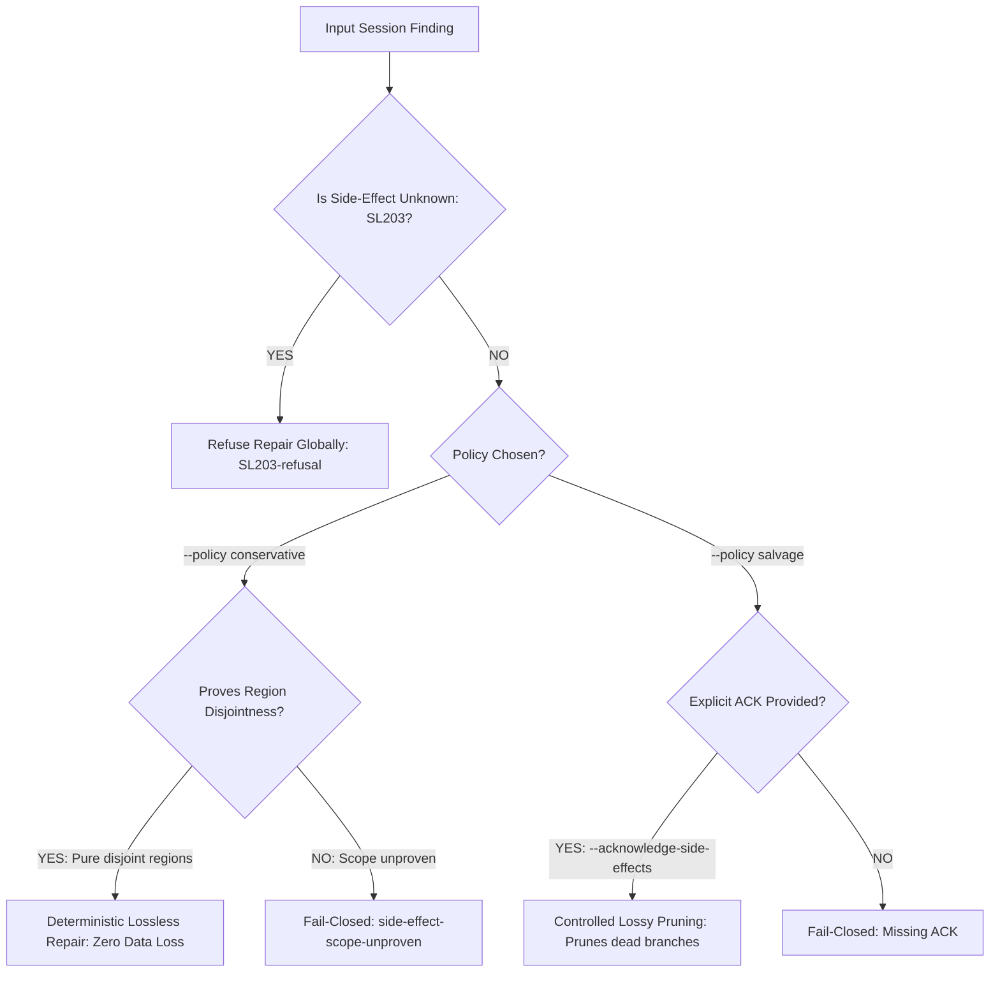
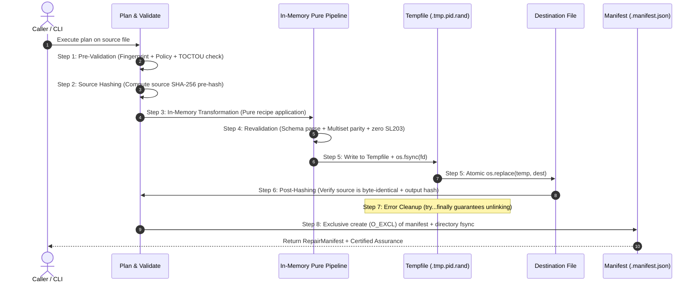

<h1 align="center">SessLint</h1>

<p align="center">
  <strong>Offline, vendor-neutral session-integrity checker and conservative repair engine for tool-using AI agents.</strong>
</p>

<p align="center">
  <a href="https://pypi.org/project/sesslint/"></a>
  <a href="#quick-start"></a>
  <a href="#license"></a>
  <a href="#architecture--anti-leak-boundaries"></a>
  <a href="#test-suite--verification"></a>
  <a href="#test-suite--verification"></a>
  <a href="#assurance-taxonomy-a0a4"></a>
  <a href="#ci--pre-commit-integration"></a>
</p>

<p align="center">
  <em>When processes crash mid-append, network streams drop, or context window compaction splits tool pairings,<br>
  LLM providers reject the replayed history with cryptic 400 errors.<br>
  <strong>SessLint provides static analysis and compiler-grade surgical repair for agent execution ledgers.</strong></em>
</p>

---

## Table of Contents

- [The Anatomy of Agent Session Failure](#the-anatomy-of-agent-session-failure)
- [Why SessLint? (The Value Proposition)](#why-sesslint-the-value-proposition)
- [The 5 Silent Traps in Autonomous Agent Sessions](#the-5-silent-traps-in-autonomous-agent-sessions)
- [Core Invariants & Safety Guarantees](#core-invariants--safety-guarantees)
- [Four Layers of Correctness](#four-layers-of-correctness)
- [Quick Start](#quick-start)
- [Interactive Terminal Showcase](#interactive-terminal-showcase)
- [CLI Reference](#cli-reference)
  - [Command Matrix](#command-matrix)
  - [Exit Codes](#exit-codes)
- [Supported Formats & Conformance Matrix](#supported-formats)
- [Diagnostic Reason Codes (SL001–SL402)](#diagnostic-reason-codes-sl001sl402)
- [Finding Fingerprints & Deterministic Ordering](#finding-fingerprints--deterministic-ordering)
- [Report Coverage & Run-State Evidence](#report-coverage--run-state-evidence)
- [Repair Engine](#repair-engine)
  - [Policies: Conservative vs. Salvage](#policies-conservative-vs-salvage)
  - [Dual-Gate Side-Effect Abstention Engine](#dual-gate-side-effect-abstention-engine)
  - [Recipe Catalog](#recipe-catalog)
  - [Atomic 8-Step Execution Protocol](#atomic-8-step-execution-protocol)
  - [Repair Manifest Schema & Cryptographic Binding](#repair-manifest-schema--cryptographic-binding)
  - [Assurance Taxonomy (A0–A4)](#assurance-taxonomy-a0a4)
- [Replay Profiles](#replay-profiles)
- [Architecture & Anti-Leak Boundaries](#architecture--anti-leak-boundaries)
- [Ecosystem & Framework Integrations](#ecosystem--framework-integrations)
- [Python Library API](#python-library-api)
  - [One-Call Prevention API (`precheck`)](#one-call-prevention-api-precheck)
  - [High-Level Programmatic API (`sesslint.api`)](#high-level-programmatic-api-sesslintapi)
  - [Low-Level Modular Primitives](#low-level-modular-primitives)
- [CI & Pre-Commit Integration](#ci--pre-commit-integration)
- [JSON Schemas](#json-schemas)
- [Compatibility & Migration Notes (NDP-001)](#compatibility--migration-notes-ndp-001)
- [Test Suite & Verification](#test-suite--verification)
- [Safe Issue Reporting & Adapter Requests](#safe-issue-reporting--adapter-requests)
- [Contributing & Fixture Provenance](#contributing--fixture-provenance)
- [Release & Build Protocol](#release--build-protocol)
- [License](#license)

---

## The Anatomy of Agent Session Failure

Modern tool-using AI agents (such as **Anthropic Claude Code**, **OpenAI Agents SDK**, and **Codex CLI**) do not merely maintain simple chat histories. They execute **distributed stateful transactions** recorded in append-only session ledgers (typically `.jsonl` or `.json` streams).

Every session record encapsulates a node in an immutable execution Directed Acyclic Graph (DAG):
- **User Intent**: Root requests, follow-up constraints, or human-in-the-loop approvals.
- **Model Reasoning**: Thoughts, assistant completions, and structured `tool_use` invocations.
- **Environment Side-Effects**: Execution results returned from bash commands, file system writes, API calls, or database mutations.
- **Memory Compaction**: Summarization markers designed to compress older turns within strict LLM context token windows.
- **State Checkpoints**: Durable snapshots of agent variables, memory buffers, and continuation pointers.

### The Breakdown

When a developer machine reboots, a Docker container hits an OOM kill, a network socket disconnects mid-stream, or a naive compaction algorithm prunes history, the serialized ledger fractures:

```
[User Turn] ──> [Assistant: tool_use(id="call_99", name="db_migrate")]
                               │
                               │  ⚡ CRASH / DISCONNECTION / COMPACTION SPLIT
                               ▼
                    [??? MISSING RECORD ???]
                               │
                               ▼
               [User: "What is the status?"]
```

When this fractured session is subsequently replayed to the model provider:

```text
anthropic.BadRequestError: 400 - tool_use ids were found without tool_result blocks: call_99
openai.BadRequestError: 400 - Invalid message sequence: 'tool_call_id' 'call_99' was not found
```

At this juncture, most agent architectures enter an unrecoverable crash loop or hallucinate state, prompting engineers to manually delete corrupted logs or re-run expensive sessions from scratch—risking duplicate side-effects in production databases.

---

## Why SessLint? (The Value Proposition)

SessLint acts as an **offline compiler-grade static analyzer and transactional repair engine** for agent sessions before replay.

```mermaid
flowchart TD
    subgraph Without SessLint
        A1[Corrupted Session File] --> B1[Agent Resumes Session]
        B1 --> C1[LLM API Call]
        C1 --> D1[HTTP 400 Bad Request]
        D1 --> E1[Agent Crash Loop / Hallucinated Retry]
        E1 --> F1[Duplicate Destructive Side-Effects & Lost Tokens]
    end

    subgraph With SessLint
        A2[Corrupted Session File] --> B2[sesslint precheck / check]
        B2 -->|Static offline diagnosis| C2{Integrity Verified?}
        C2 -->|Defects Detected| D2[sesslint repair --policy conservative]
        D2 -->|Deterministic 8-step atomic commit| E2[Repaired Session + Bound Manifest]
        E2 --> F2[Agent Resumes Flawlessly With Zero Data Loss]
        C2 -->|Clean| F2
    end
```



| Operational Dimension | Without SessLint | With SessLint |
| :--- | :--- | :--- |
| **Failure Detection** | Runtime HTTP 400 during LLM inference | Static offline pre-flight check in milliseconds |
| **Data Recovery** | Manual JSON editing or discarding entire sessions | Automated, deterministic, byte-verified repair |
| **Side-Effect Safety** | Blind retries re-trigger mutations (e.g. bash scripts) | Fail-closed Scoped Abstention Gate protects real-world state |
| **Auditability** | Silent file modifications with zero provenance | Cryptographically bound manifest (`<target>.manifest.json`) |
| **Runtime Footprint** | Heavy cloud dependencies & telemetry | 100% standard library Python, zero dependencies, completely offline |

---

## The 5 Silent Traps in Autonomous Agent Sessions

Agent session ledgers fail in a small number of recurring ways. SessLint detects and resolves five fundamental defect classes:

### 1. The Torn Terminal Record (`SL002`)
- **The Cause**: Agent CLI tools stream event records via unbuffered or semi-buffered `write()` calls. When the process receives `SIGINT`, `SIGTERM`, or an OS power drop, the final record is truncated halfway through a JSON token (e.g., `{"role": "assistant", "tool_calls": [{"id": "call_42", "nam`).
- **The Impact**: Python's standard `json.loads()` fails immediately with `JSONDecodeError: Unterminated string`.
- **SessLint Solution**: The streaming reader isolates the terminal torn byte sequence, verifies all preceding lines, and the conservative recipe `torn-terminal-record-discard` prunes the uncommitted fragment while preserving the complete valid history.

### 2. The Broken Causal DAG (`SL004`, `SL005`, `SL006`, `SL007`)
- **The Cause**: Asynchronous agent execution or multi-agent branching creates dangling parent pointers (`SL004`), cyclic execution loops (`SL005`), or orphaned disconnected subtrees (`SL006`).
- **The Impact**: Graph topological sort fails; conversation order becomes nondeterministic.
- **SessLint Solution**: Validates parent lineage invariants. Recipe `proven-unique-parent-restore` uses strict full-equality candidate matching within the same compaction segment to safely reattach parents without guessing.

### 3. Asymmetric Compaction Splits (`SL108`)
- **The Cause**: To conserve tokens, context compaction algorithms summarize history by dropping early messages. However, sliding-window compaction frequently drops a `tool_use` record while retaining its `tool_result`, or vice versa.
- **The Impact**: Model providers enforce that every `tool_result` must directly follow or correspond to an active `tool_use`. Violating this invariant yields immediate fatal HTTP 400 rejections.
- **SessLint Solution**: Detects boundary fractures. Recipe `compaction-projection-reunion` relocates compaction boundary markers to preserve pair atomicity.

### 4. The Dangling Side-Effect Mutation (`SL102`, `SL203`)
- **The Cause**: An agent executes a mutation command (e.g., `rm -rf tmp/` or `git push`), but the host system halts before the command's exit code is returned and appended to the ledger.
- **The Impact**: If an automated tool naively fabricates a synthetic result or drops the call, the model operates under a false belief regarding real-world disk state.
- **SessLint Solution**: **The Scoped Abstention Gate (DEV-013)**. SessLint strictly refuses to synthesize reality (`SL203`). If an unrecorded side-effect exists, SessLint proves whether candidate repairs intersect that unverified region, failing closed if safety cannot be proven mathematically.

### 5. The Synthetic Identifier Squatting Hazard (`DEV-007`)
- **The Cause**: When converting unstructured vendor logs to canonical formats, naive converters generate sequential identifiers like `rec_0`, `rec_1`. If the original session already contained a record with that identifier, state shadowing occurs.
- **The Impact**: False `SL003` duplicate findings, corrupted event resolution, and broken replay bindings.
- **SessLint Solution**: A reserved collision-resistant namespace (`sesslint:synthetic:<adapter>:<ordinal>:<hash>`) backed by an active `SyntheticIdCollisionGuard` that asserts zero namespace collisions at ingest time.

---

## Core Invariants & Safety Guarantees

> [!IMPORTANT]
> **The Bottom Line on Safety & Atomicity**
>
> 1. **Source Immutability**: SessLint never modifies user files in-place. `check`, `scan`, `verify`, and `repair --dry-run` perform zero file writes.
> 2. **Single Mutator Principle**: File mutation is strictly isolated to a single atomic executor (`sesslint/repair/executor.py`) via `tempfile` &rarr; `os.fsync` &rarr; `os.replace`.
> 3. **Kill-Safety**: Any unhandled crash or `SIGKILL` at any microsecond of execution leaves the original source byte-identical with zero orphaned temporary files.
> 4. **No Synthetic Truth**: SessLint never fabricates tool results, user approvals, or model tokens.
> 5. **TOCTOU Protection**: Dual-hash SHA-256 verification ensures that modifications to source files during execution immediately abort the pipeline.
> 6. **Zero Dependencies**: Built exclusively on the Python 3.11+ standard library. 100% offline, zero telemetry, zero background network calls.
> 7. **Privacy by Default**: Diagnostic reports and repair manifests are strictly content-free (prompts, code, keys, and tokens are scrubbed).
> 8. **Safety & Minimization Boundaries**: redaction is best-effort minimization, not a completeness guarantee. Furthermore, sesslint makes no semantic or side-effect safety claims.

---

## Four Layers of Correctness

SessLint partitions session validity into four orthogonal tiers:

```text
┌────────────────────────────────────────────────────────────────────────┐
│  Layer 4: Semantic & Side-Effect Safety                                │
│  Did external mutations actually execute in the real world?            │
│  Enforcement: Explicit Abstention (SL203) - Never guess reality        │
├────────────────────────────────────────────────────────────────────────┤
│  Layer 3: Replay Conformance                                           │
│  Adherence to provider-specific turn alternation and role adjacency    │
│  Enforcement: Replay Profiles (neutral, claude-strict, openai-strict)  │
├────────────────────────────────────────────────────────────────────────┤
│  Layer 2: Structural & Relational Integrity                            │
│  DAG parentage, unique event IDs, causal tool call/result pairing      │
│  Enforcement: Core Rule Engine (SL003 - SL108)                         │
├────────────────────────────────────────────────────────────────────────┤
│  Layer 1: Syntactic & Stream Framing                                   │
│  Valid UTF-8 byte stream, valid JSON/JSONL framing, streaming limits   │
│  Enforcement: Bounded Streaming Lookahead Reader (SL001, SL002)       │
└────────────────────────────────────────────────────────────────────────┘
```

| Layer | Definition | SessLint Enforcement |
| :--- | :--- | :--- |
| **1. Syntactic** | Valid byte stream, valid JSON/JSONL syntax, UTF-8 adherence. | Bounded streaming parser, torn-tail detection (`SL001`, `SL002`). |
| **2. Structural** | Valid DAG parentage, unique identities, valid tool call/result pairing. | Identity checks, cycle detection, tool pairing rules (`SL003`–`SL108`). |
| **3. Replay** | Conformance to specific LLM provider turn and adjacency rules. | Provider replay profiles (`neutral`, `claude-strict`, `openai-strict`). |
| **4. Semantic & Side-Effect** | Whether an external side-effect actually executed in the real world. | **Explicit Abstention (`SL203`)**: SessLint refuses to guess unrecorded side effects. |

---

## Quick Start

### Installation

```bash
# Direct install with pip
pip install sesslint

# Isolated installation with pipx (recommended for global CLI)
pipx install sesslint

# Or with uv
uv tool install sesslint

# Verify installation
sesslint --version
```

No Python? Releases since v0.2.0 also ship **standalone binaries**
(`sesslint-<version>-<os>-<arch>[.exe]` for Linux, macOS, and Windows)
on [GitHub Releases](https://github.com/HPNChanel/sesslint/releases) — no interpreter required:

```bash
# Download the binary for your OS, then verify it against the published checksums
curl -LO https://github.com/HPNChanel/sesslint/releases/download/v0.3.0/sesslint-0.3.0-linux-x86_64
curl -LO https://github.com/HPNChanel/sesslint/releases/download/v0.3.0/sha256sums.txt
sha256sum -c sha256sums.txt --ignore-missing   # Windows: Get-FileHash -Algorithm SHA256 .\sesslint-*.exe

chmod +x sesslint-0.3.0-linux-x86_64
./sesslint-0.3.0-linux-x86_64 version --json
```

Substitute the current release tag and your platform asset (`macos-arm64`,
`windows-x86_64.exe`) as needed.

Release artifacts also carry Sigstore signatures (`<name>.sigstore.json`)
made by the release workflow's own OIDC identity — verify with
[`cosign verify-blob`](RELEASING.md#4-verify-sigstore-signatures) before
installing:

```bash
cosign verify-blob \
  --bundle sesslint-0.3.0-linux-x86_64.sigstore.json \
  --certificate-identity-regexp "github.com/HPNChanel/sesslint" \
  --certificate-oidc-issuer "https://token.actions.githubusercontent.com" \
  sesslint-0.3.0-linux-x86_64
```

The canonical artifact set (wheel, sdist, `sha256sums.txt`, manifest) also
carries SLSA v1 provenance in `sesslint-provenance.intoto.jsonl` — verify
with [`slsa-verifier verify-artifact`](RELEASING.md#5-verify-slsa-provenance).

Package-manager manifests ship in `packaging/` (rendered per release by
`scripts/render_manifests.py`, pinned version + sha256). Self-hosted
channels roll out first; upstream submissions follow:

```bash
brew install HPNChanel/tap/sesslint          # Homebrew tap (macOS + Linux)
scoop bucket add sesslint https://github.com/HPNChanel/scoop-bucket
scoop install sesslint                      # Windows
winget install HPNChanel.Sesslint           # Windows (pending winget-pkgs PR)
yay -S sesslint-bin                         # Arch Linux AUR (manual publish)
```

A container image ships to GHCR on every release — useful for CI sandboxes
and Docker-first setups (distroless nonroot, no shell, ~10 MB binary):

```bash
docker run --rm -v "$PWD:/data"   ghcr.io/hpnchanel/sesslint:0.3.0 check /data/session.jsonl
```

The image is built from the same Sigstore-signed linux binary as the other
release assets; mounts are yours — the container writes nothing internally.

### 30-Second Workflow

```bash
# 1. Inspect and lint a session file (auto-detects format)
sesslint check session.jsonl

# 2. Check under a strict provider profile
sesslint check session.jsonl --profile claude-strict

# 3. Simulate repair plan without touching disk
sesslint repair session.jsonl --dry-run

# 4. Atomically repair and generate a cryptographically bound manifest
sesslint repair session.jsonl --output session.repaired.jsonl

# 5. Output structured machine-readable JSON for CI/CD pipelines
sesslint check session.jsonl --profile neutral --json > report.json
```

---

## Interactive Terminal Showcase

Here is what SessLint looks like in action in production development environments:

### 1. Diagnosing a Corrupted Session (`sesslint check`)

```text
$ sesslint check corrupted_session.jsonl --profile claude-strict
[read-only] verdict: invalid | errors: 1 | warnings: 1 | files: H=0 I=1 U=0 R=0 S=0 | profile: claude-strict | adapter: claude-code-jsonl
Next Action: Run 'sesslint repair corrupted_session.jsonl --output <file>' to plan repair.

FINDINGS (2):
  [SL002] error [deterministic] at corrupted_session.jsonl:48:1
    Torn terminal record at line 48: unexpected end of stream mid-record
    Fingerprint: 8a4f10c3b9e27d14 | Span: byte 4096-4142
    Evidence: {"byte_offset": 4096, "byte_end": 4142, "record_ordinal": 47}

  [SL107] warning [manual] at corrupted_session.jsonl:24:1
    Adjacency violation: tool_use followed by user turn instead of tool_result
    Fingerprint: 3c2d89a10ef45b77 | Record: sesslint:synthetic:claude:23:7a8b
    Evidence: {"prior_role": "assistant", "current_role": "user"}

COVERAGE: 22 rules evaluated, 0 skipped.
ASSURANCE: A0 (unreadable) -> Replay invalid.
```

### 2. Surgical Atomic Repair (`sesslint repair`)

```text
$ sesslint repair corrupted_session.jsonl --output session.fixed.jsonl --policy conservative
[sesslint:repair] Target: corrupted_session.jsonl (size: 4,142 bytes)
[sesslint:repair] Strategy: conservative (zero data loss policy)
[sesslint:repair] Step 1/8: Pre-validation passed. Fingerprint: 8a4f10c3b9e27d14
[sesslint:repair] Step 2/8: Source SHA-256 pre-hashed: e3b0c44298fc1c149afbf4c8...
[sesslint:repair] Step 3/8: Applying 1 recipe:
  -> torn-terminal-record-discard: pruned 46 trailing torn bytes
[sesslint:repair] Step 4/8: In-memory revalidation passed. Zero SL203. Post-Assurance: A3
[sesslint:repair] Step 5/8: Committed atomically via tempfile -> fsync -> os.replace
[sesslint:repair] Step 6/8: Post-hashing verified source immutability. Output SHA-256: 9b2d8...
[sesslint:repair] Step 7/8: Temp file cleaned up.
[sesslint:repair] Step 8/8: Wrote cryptographic audit receipt: session.fixed.jsonl.manifest.json

[repaired-lossless] Output: session.fixed.jsonl (Assurance: A3 | 47 records preserved | 0 errors)
Next Action: Run 'sesslint verify corrupted_session.jsonl session.fixed.jsonl --manifest session.fixed.jsonl.manifest.json' to audit.
```

### 3. Cryptographic Audit & Verification (`sesslint verify`)

```text
$ sesslint verify corrupted_session.jsonl session.fixed.jsonl --manifest session.fixed.jsonl.manifest.json
[audit:pass] Manifest cryptographically matches source and output fingerprints.
[audit:pass] 7 verification checks passed:
  [✔] Source fingerprint verified (e3b0c44298fc1c149afbf4c8...)
  [✔] Output fingerprint verified (9b2d8f0714b629c8e821034a...)
  [✔] Idempotency key verified (64-hex SHA-256 bound to plan + policy)
  [✔] Manifest receipt immutable (created with O_EXCL)
  [✔] Output schema valid (sesslint.session/v1)
  [✔] Multiset parity verified (zero phantom records introduced)
  [✔] Idempotence verified: repairing output yields identical hash
VERDICT: VERIFIED (Replay Safe, Assurance Ceiling: A3)
```

---

## CLI Reference

```text
sesslint [--version] COMMAND [OPTIONS]
```

### Command Matrix

SessLint exposes seventeen CLI commands designed for both interactive developer usage and CI/CD automation (plus `sesslint completion` for shell integration):

| Command | Purpose | Mutates Disk? | Default Format | Exit Codes |
| :--- | :--- | :---: | :---: | :---: |
| **`sesslint check`** | Scan and lint a session file or directory for defects | **No** (read-only) | `auto` | `0`, `1`, `2` |
| **`sesslint scan`** | Traverse directory trees (or auto-discover agent session roots) with 5-bucket triage | **No** (read-only) | `auto` | `0`, `1`, `2` |
| **`sesslint repair`** | Plan and execute atomic surgical session repairs | **Yes** (to `--output`) | `auto` | `0`, `1`, `2` |
| **`sesslint verify`** | 7-stage cryptographic audit of repair and manifest | **No** (read-only) | `auto` | `0`, `1`, `2` |
| **`sesslint bundle`** | Emit zero-leak diagnostic support bundle for bug/adapter reports | **Optional** (`--out`) | `auto` | `0`, `1`, `2` |
| **`sesslint export`** | Export a vendor artifact to a canonical file for repair | **Yes** (to `--output`) | `auto` | `0`, `1`, `2` |
| **`sesslint validate-session`**| Validate canonical session against JSON Schema | **No** (read-only) | `canonical` | `0`, `1`, `2` |
| **`sesslint formats`** | List supported adapters and format schemas | **No** | N/A | `0` |
| **`sesslint completion`** | Print shell completion script (bash, zsh, fish, powershell) | **No** | N/A | `0` |
| **`sesslint baseline`** | Upgrade a v1 baseline file to path-normalized v2 | **Optional** (`--output`) | N/A | `0`, `2` |
| **`sesslint diff`** | Structural diff of two session files by event identity | **No** (read-only) | `auto` | `0`, `1`, `2` |
| **`sesslint stats`** | Content-free aggregate statistics over session files/dirs | **No** (read-only) | `auto` | `0`, `2` |
| **`sesslint doctor`** | Environment diagnostics: versions, config, agent roots, quick verdicts | **No** (read-only) | N/A | `0`, `2` |
| **`sesslint watch`** | Poll session dirs, flag newly corrupted files on verdict transitions | **No** (read-only observer) | `auto` | `0`, `2` |
| **`sesslint mcp`** | MCP stdio server exposing check/precheck/scan tools to agents | **No** (read-only stdio) | N/A | `0` |
| **`sesslint init-hooks`** | Print ready-to-merge agent hook snippets — never writes config | **No** (print-only) | N/A | `0` |
| **`sesslint hook`** | Agent hook entrypoint: stdin payload → resolved transcript check | **No** (read-only) | `auto` | `0`, `1` |
| **`sesslint version`** | Print diagnostic version environment struct | **No** | N/A | `0` |

---

#### `sesslint check`
Scan and validate session files or directories for structural corruptions and provider rule violations.

```bash
sesslint check <path> [<path> ...] [OPTIONS]
```

Multiple paths aggregate into a single scan report — this is what the
pre-commit hook relies on when it appends every staged file to one invocation.
`-` reads one session artifact from stdin (max 100 MB), e.g.
`type rollout.jsonl | sesslint check -`.

| Option | Type | Default | Description |
| :--- | :--- | :--- | :--- |
| `path` | `Path` | *required* | Session file path(s) (`.json` or `.jsonl`), a directory (with `--recursive`), or `-` for stdin. |
| `--recursive`, `-r` | `flag` | `False` | Recursively scan directories and report 5-bucket totals. |
| `--format` | `choice` | `auto` | Force adapter: `auto`, `claude-code-jsonl`, `openai-agents`, `codex-rollout`, `canonical`. |
| `--profile` | `string` | `neutral` | Replay validation profile (`neutral`, `claude-strict`, `openai-strict`). |
| `--json` | `flag` | `False` | Emit machine-readable JSON report. |
| `--output-format` | `choice` | `human` | Output format: `human`, `json`, `sarif` (SARIF 2.1.0 for GitHub code scanning), or `html` (self-contained report file; mutually exclusive with `--json`). |
| `--fail-on` | `choice` | `error` | Minimum finding severity that fails the command (`error` or `warning`). |
| `--select` | `CSV` | — | Comma-separated rule codes to run exclusively (mutually exclusive with `--ignore`). |
| `--ignore` | `CSV` | — | Comma-separated rule codes to skip, including detection-stage findings (e.g. `SL302`). |
| `--baseline` | `Path` | — | Suppress findings whose fingerprints are recorded in a baseline file. |
| `--write-baseline` | `Path` | — | Write current finding fingerprints as a new baseline file (mutually exclusive with `--baseline`). |
| `--skip-undetected` | `flag` | `False` | Classify format-undetected files as `skipped` instead of `invalid` (hooks, mixed-content trees). |
| `--exclude` | `GLOB` | — | Skip files/dirs whose name or root-relative path matches GLOB during directory walks (repeatable). |
| `--ext` | `EXT` | — | Only inspect files with these extensions during directory walks (repeatable). |
| `--config` | `Path` | — | Explicit config file path (overrides `[tool.sesslint]` discovery). |
| `--progress-json` | `flag` | `False` | Emit NDJSON progress events to **stderr** (stdout stays the result channel); used by supervising UIs/CI wrappers. |
| `--confidence-min` | `float` | `0.55` | Minimum auto-detection confidence threshold. |
| `--margin-min` | `float` | `0.15` | Minimum auto-detection margin above second-place format. |
| `--max-files` | `int` | `10000` | Maximum number of files to inspect during recursive scan. |
| `--max-bytes` | `int` | `1GB` | Maximum cumulative bytes to read during recursive scan. |
| `--follow-symlinks` | `flag` | `False` | Follow directory symlinks during recursive scanning. |
| `--include-content` | `flag` | `False` | Embed raw transcript content in reports (warning: emits raw sensitive data). |
| `--color` | `choice` | `auto` | Control colored output: `auto`, `always`, `never`. |
| `--no-color` | `flag` | `False` | Disable ANSI color styling (equivalent to `NO_COLOR=1`). |

> [!NOTE]
> `--policy` is valid exclusively for `repair`, not `check`. Passing `--policy` to `check` errors immediately with exit code 2.

---

#### `sesslint scan`
Scan directory trees for session artifacts or display reader resource limits.

```bash
sesslint scan [path] [OPTIONS]
sesslint scan --agent claude|codex|all
sesslint scan --show-limits
```

| Option | Type | Default | Description |
| :--- | :--- | :--- | :--- |
| `path` | `Path` | *optional* | Directory path to scan recursively (required unless `--agent` or `--show-limits`), or `-` for stdin (max 100 MB). |
| `--agent` | `choice` | — | Auto-discover well-known session roots: `claude` (`$CLAUDE_CONFIG_DIR/projects` else `~/.claude/projects`), `codex` (`$CODEX_HOME/sessions` else `~/.codex/sessions`), or `all`. Read-only; an explicit `path` overrides it. |
| `--show-limits` | `flag` | `False` | Display configured reader resource limits (max line length, max bytes) and exit 0. |
| `--recursive`, `-r` | `flag` | `True` | Recursively scan directory trees (default: `True`). |
| `--max-files` | `int` | `10000` | Maximum number of files to process before aborting. |
| `--max-bytes` | `int` | `1GB` | Maximum cumulative bytes to process before aborting. |
| `--format` | `choice` | `auto` | Force adapter: `auto`, `claude-code-jsonl`, `openai-agents`, `codex-rollout`, `canonical`. |
| `--profile` | `string` | `neutral` | Replay validation profile (`neutral`, `claude-strict`, `openai-strict`). |
| `--json` | `flag` | `False` | Emit machine-readable JSON scan report with 5-bucket totals. |
| `--output-format` | `choice` | `human` | Output format: `human`, `json`, `sarif`, or `html` (self-contained report file; mutually exclusive with `--json`). |
| `--fail-on` | `choice` | `error` | Minimum finding severity that fails the command (`error` or `warning`). |
| `--select` | `CSV` | — | Comma-separated rule codes to run exclusively (mutually exclusive with `--ignore`). |
| `--ignore` | `CSV` | — | Comma-separated rule codes to skip, including detection-stage findings. |
| `--baseline` | `Path` | — | Suppress findings whose fingerprints are recorded in a baseline file. |
| `--write-baseline` | `Path` | — | Write current finding fingerprints as a new baseline file. |
| `--skip-undetected` | `flag` | `False` | Classify format-undetected files as `skipped` instead of `invalid`. |
| `--exclude` | `GLOB` | — | Skip files/dirs matching GLOB during the walk (repeatable). `.git` trees and SessLint-generated artifacts are always excluded. |
| `--ext` | `EXT` | — | Only inspect files with these extensions (repeatable). |
| `--config` | `Path` | — | Explicit config file path (overrides `[tool.sesslint]` discovery). |
| `--progress-json` | `flag` | `False` | Emit NDJSON progress events to **stderr** (stdout stays the result channel). |
| `--jobs` | `N` | `1` | Parallel worker processes for per-file analysis (`auto`/`0` = CPU count). Report output is identical for any N — only wall time changes. Pays off when average per-file analysis exceeds ~0.5 s. Ignored for single-file input. |
| `--incremental` | `flag` | `False` | Reuse cached per-file results when file content is provably unchanged (SHA-256, never mtime). Replayed entries are marked `"cache": "hit"` in JSON / `[cache-hit]` in human output; findings and verdicts are identical. `unreadable` files are never cached. |
| `--cache-dir` | `DIR` | platform | Override the incremental cache directory. Default: `$SESSLINT_CACHE_DIR`, else `%LOCALAPPDATA%\sesslint` (Windows) or `$XDG_CACHE_HOME/sesslint` / `~/.cache/sesslint`. Never created inside the scanned tree. |
| `--top` | `N` | `10` | Show up to N worst files in the report summary (`0` disables the worst-files view). |
| `--group-by` | `choice` | `code` | Summary grouping: `code` aggregates findings by rule code; `none` disables the by-code view. |
| `--follow-symlinks` | `flag` | `False` | Follow symbolic links during directory traversal. |
| `--color` | `choice` | `auto` | Control colored output: `auto`, `always`, `never`. |
| `--no-color` | `flag` | `False` | Disable ANSI color styling. |

---

#### `sesslint repair`
Plan and execute verified, atomic session repairs.

```bash
sesslint repair <path> --output <out_path> [OPTIONS]
```

| Option | Type | Default | Description |
| :--- | :--- | :--- | :--- |
| `path` | `Path` | *required* | Source session file to repair, or `-` to read the source from stdin (max 100 MB; staged internally through a private temp file so the full atomic-repair protocol applies unchanged). |
| `--output`, `-o` | `Path` | *required* | Distinct destination path (required unless `--dry-run`). |
| `--dry-run` | `flag` | `False` | Computes and displays plan; creates zero files on disk. |
| `--policy` | `choice` | `conservative` | `conservative` (zero data loss) or `salvage` (explicit lossy pruning). |
| `--format` | `choice` | `auto` | Force input adapter: `auto`, `claude-code-jsonl`, `openai-agents`, `codex-rollout`, `canonical`. |
| `--emit` | `choice` | `auto` | Output format: `auto` (vendor write-back where supported, otherwise canonical), `canonical`, or `vendor` (refused for formats without write-back support). |
| `--progress-json` | `flag` | `False` | Emit NDJSON progress events to **stderr** (stdout stays the result channel). |
| `--profile` | `string` | `neutral` | Replay validation profile (`neutral`, `claude-strict`, `openai-strict`). |
| `--plan`, `--apply-plan` | `Path` | `None` | Apply a previously exported plan (`sesslint.plan/v1`) without re-planning; the plan is authoritative — `--policy`/`--profile`/`--format` overrides are refused, and the plan fingerprint plus source binding are re-validated before any write. |
| `--plan-out` | `Path` | `None` | Export the computed repair plan (`sesslint.plan/v1`) for review or later `--apply-plan`; plan-only when `--output` is absent, export-then-apply otherwise. |
| `--batch` | `Path` | `None` | Batch-repair every eligible file under a directory (eligibility = plan has steps and zero blocked findings). |
| `--from-scan` | `Path` | `None` | Batch-repair files listed in a scan JSON report (`~/` paths resolve; `.._<hash>` entries report skipped). |
| `--files` | `Path...` | `None` | Batch-repair an explicit file list. |
| `--output-dir` | `Path` | `None` | Output root for batch modes — mirrors the input's relative structure with `<stem>.repaired<suffix>` names. |
| `--manifest-dir` | `Path` | `None` | Manifest root for batch modes (`<sha8-of-path>.manifest.json`); default is adjacent to each output. |
| `--preview` | `flag` | `False` | Render a content-free structural diff of the repair plan — drops, relinks, dedupes, tail-discards + blocked findings — with zero writes; composes with `--json`, incompatible with write/plan flags. |
| `--acknowledge-side-effects`| `flag` | `False` | Acknowledge tool side-effects for salvage policy. |
| `--salvage-unsupported` | `flag` | `False` | *Deprecated*: Use `--policy salvage` instead. |
| `--include-content` | `flag` | `False` | Embed raw transcript content in manifests (warning: emits raw sensitive data). |
| `--json` | `flag` | `False` | Emit machine-readable JSON plan or repair manifest. |

> [!NOTE]
> **Plan Export / Apply**: `sesslint repair IN --plan-out plan.json` writes the computed plan as a `sesslint.plan/v1` document and stops (no output/manifest). Review or archive it, then `sesslint repair IN --apply-plan plan.json --output OUT` executes it later — the plan fingerprint is recomputed and the plan's `source_hash` is re-validated against the live source before any write, so a stale source refuses with `PLAN_SOURCE_MISMATCH` (plan-stale) and an edited plan refuses with `PLAN_TAMPERED`. The plan is authoritative: `--policy`/`--profile`/`--format` overrides are refused at apply time; policy and profile derive from the plan document itself. `repair IN --plan-out p.json --output OUT` composes export and apply in one run.
>
> [!NOTE]
> **Batch Repair**: `sesslint repair --batch DIR --output-dir out/ [--manifest-dir m/]` repairs every file whose computed plan has steps and zero blocked findings — the planner's own eligibility classification, fail-closed and non-overridable. Ineligible files are never attempted and are reported with their blocking code+reason; `--from-scan report.json` drives a batch from a scan report and `--files F...` takes an explicit list. Outputs mirror the input's relative structure under `--output-dir`; exit is `0` only when nothing was skipped or refused (partial success is honest), `1` otherwise. `--dry-run` previews eligibility without writes. Per-file atomicity is unchanged; the batch has no cross-file transaction.
>
> [!NOTE]
> **Structural Preview**: `sesslint repair IN --preview` runs the full detection+planning pipeline and renders the would-be outcome as a content-free structural delta — `drop`, `relink`, `discard-tail`, `dedupe` rows with bounded event ids, kinds, source lines and reason codes — so an operator can approve a repair on evidence instead of trust. Blocked findings are listed with their code+reason and the command exits `1` when the plan would refuse. `--preview` writes nothing: it composes with `--json` (emits `sesslint.preview/v1`) and is incompatible with `--output`, `--emit`, `--plan`/`--apply-plan`, `--plan-out`, and the batch flags (exit 2).
>
> [!NOTE]
> **Vendor Write-Back**: Claude Code JSONL, OpenAI Agents JSONL, and Codex rollout inputs are repaired in canonical form and projected back onto the source file's physical lines — every surviving record stays byte-identical and only lines explicitly discarded by the plan are removed. Projection refuses (exit 2, reasons R1-R6) whenever a safe verbatim projection cannot be proven: synthesized or field-rewritten events, partial-line survival, reordered lines, source drift, or non-line formats (single-document JSON exports emit `--emit canonical` instead). Emitted output is re-loaded through the original adapter and fully revalidated before the manifest is written.
>
> **`codex-rollout` inputs** are fully supported for check/scan/export and repair. As a per-line JSONL record stream, rollout files are write-back capable: `--emit auto` (the default) projects the repair onto verbatim source lines under the same R1–R6 refusal rules; `--emit canonical` produces a canonical session stream instead.

---

#### `sesslint export`
Export a supported session artifact (Claude Code, OpenAI Agents, Codex rollout, or Canonical) to a byte-deterministic canonical file that the repair pipeline accepts. This is repair-enablement, not migration: single artifact in, single file out, atomic write, refusals fail closed.

```bash
sesslint export <path> --output <canonical_path> [--format auto] [--json]
```

| Option | Type | Default | Description |
| :--- | :--- | :--- | :--- |
| `path` | `Path` | *required* | Source session file (`.json` or `.jsonl`). |
| `--output`, `-o` | `Path` | *required* | Destination canonical file (must not exist). |
| `--format` | `choice` | `auto` | Force adapter: `auto`, `claude-code-jsonl`, `openai-agents`, `codex-rollout`, `canonical`. |
| `--json` | `flag` | `False` | Emit the content-free export summary as JSON. |

---

#### `sesslint diff`
Compare two session files **structurally** — event-identity alignment, not text diff. Answers "what changed between these two sessions" for before/after comparisons (vendor update, pre/post compaction, repair output sanity review) without raw-JSONL noise.

```bash
sesslint diff <a> <b> [--format auto] [--format-a FMT] [--format-b FMT] [--output-format human|json]
```

Alignment is two-pass and deterministic: primary key `event.id` (duplicate ids pair earliest-first), then a `(kind, parent_id, content_identity_hash)` fallback multiset for unpaired events. Delta categories are content-free: `added`, `removed`, `kind-changed`, `parent-relinked`, `seq-reordered`, `content-changed` (identity hash only — never payload text). `--json` emits `sesslint.diff/v1` (`schemas/sesslint.diff.v1.json`).

| Option | Type | Default | Description |
| :--- | :--- | :--- | :--- |
| `a`, `b` | `Path` | *required* | The two session files to compare. |
| `--format` | `choice` | `auto` | Adapter for both inputs (`auto` detects each independently). |
| `--format-a`, `--format-b` | `choice` | *(from `--format`)* | Per-side format override. |
| `--output-format` | `choice` | `human` | `human` (grouped sections) or `json`. |
| `--json` | `flag` | `False` | Shortcut for `--output-format json`. |

Exit codes: `0` identical structure, `1` differences found, `2` usage/input error (missing path, undetectable format).

---

#### `sesslint stats`
Aggregate **content-free statistics** over session files or directories — "how big / what shape is my session corpus" without reading transcripts.

```bash
sesslint stats <path> [<path> ...] [-r] [--agent claude|codex|all] [--output-format human|json]
```

Counters only, never payloads: files processed/undetected/unreadable, events by canonical `kind` and `actor`, tool-call volume per **truncated sha256 tool-name hash** (raw names are never emitted), compaction-boundary and checkpoint counts, and per-file byte/event percentiles (p50/p95/max). `--json` emits `sesslint.stats/v1` (`schemas/sesslint.stats.v1.json`).

| Option | Type | Default | Description |
| :--- | :--- | :--- | :--- |
| `path` | `Path` | *(or `--agent`)* | Session file(s) or directories. |
| `-r`, `--recursive` | `flag` | `False` | Walk directory arguments recursively. |
| `--agent` | `choice` | — | Aggregate a well-known agent root (`claude`, `codex`, `all`) instead of paths. |
| `--format` | `choice` | `auto` | Adapter for all inputs. |
| `--output-format` | `choice` | `human` | `human` or `json`. |
| `--json` | `flag` | `False` | Shortcut for `--output-format json`. |

Exit codes: `0` on successful aggregation, `2` on usage error (missing path, directory without `-r`, `--agent` + paths conflict).

---

#### `sesslint doctor`
Environment diagnostics in one read — the first command a new user runs and the first thing maintainers ask for in bug reports. Answers "what does SessLint see on this machine".

```bash
sesslint doctor [--agent claude|codex|all] [--no-quick-checks] [--output-format human|json]
```

Reports tool and adapter versions, the resolved config file (or `none`), and per-agent session roots: existence, bounded file count (caps at 10k honestly), newest-file mtime, and quick verdicts on up to 5 newest files per root (verdict counts + top rule codes). **Counts and timestamps only** — never file names, never payloads; paths minimized. `--json` emits `sesslint.doctor/v1` (`schemas/sesslint.doctor.v1.json`). Diagnostics, not a gate: absent roots report `absent` and the command still exits `0`.

| Option | Type | Default | Description |
| :--- | :--- | :--- | :--- |
| `--agent` | `choice` | `all` | Restrict to one agent (`claude`, `codex`, `all`). |
| `--no-quick-checks` | `flag` | `False` | Skip the bounded per-file check pass (counts only). |
| `--output-format` | `choice` | `human` | `human` or `json`. |
| `--json` | `flag` | `False` | Shortcut for `--output-format json`. |

Exit codes: `0` always on successful diagnostics, `2` on usage error.

---

#### `sesslint watch`
Poll-based directory monitor: flag a **newly corrupted session file the moment it lands** — prevention posture, before the next resume reads the poisoned ledger. Portable by construction (stdlib `scandir` snapshots, no OS-event dependency, no runtime deps).

```bash
sesslint watch [<path> ...|--agent claude|codex|all] [--interval SEC] [--json]
```

Semantics: mtime+size snapshots under the resolved roots (same built-in exclusions as `scan`), debounced one full interval before checking (agents append in bursts), then the normal check pipeline on that file only. Emits **one line per verdict transition** (`healthy->invalid`, minimized path + rule codes) — repeated states stay quiet. Pure observer: never writes, never installs hooks; Ctrl+C exits cleanly. Per-file state table is LRU-bounded (4096 files). `--json` emits `sesslint.watch-event/v1` NDJSON transitions.

| Option | Type | Default | Description |
| :--- | :--- | :--- | :--- |
| `path` | `Path` | *(or `--agent`)* | File(s) or directories to watch. |
| `--agent` | `choice` | — | Watch a well-known agent root (`claude`, `codex`, `all`). |
| `--interval` | `float` | `2.0` | Poll interval seconds (min `0.05`). |
| `--format` | `choice` | `auto` | Adapter for all watched files. |
| `--json` | `flag` | `False` | NDJSON transition events. |

Exit codes: `0` on clean shutdown (Ctrl+C) or completion, `2` on usage error.

---

#### Shell completion
`sesslint completion` prints a completion script generated from the live parser (bash, zsh, fish, or PowerShell). Install it with:

```bash
eval "$(sesslint completion bash)"   # or: zsh, fish
```

```powershell
sesslint completion powershell >> $PROFILE   # PowerShell 7 / Windows PowerShell 5.1
```

---

#### `sesslint verify`
Independently audit integrity, cryptographic hash bindings, manifest actions, and idempotence of a repaired session.

```bash
sesslint verify <source> <repaired> --manifest <manifest> [OPTIONS]
```

| Option | Type | Default | Description |
| :--- | :--- | :--- | :--- |
| `source` | `Path` | *required* | Original source session file path (positional or `--source`). |
| `repaired`| `Path` | *required* | Repaired output session file path (positional or `--output`). |
| `--manifest` | `Path` | *required* | Cryptographically bound repair manifest JSON path. |
| `--plan` | `Path` | `None` | Path to repair plan JSON file (optional). |
| `--acknowledge-side-effects`| `flag` | `False` | Acknowledge tool side-effects for salvage policy during verify idempotence check. |
| `--include-content` | `flag` | `False` | Embed raw transcript content (warning: emits raw sensitive data). |
| `--json` | `flag` | `False` | Emit machine-readable JSON verdict. |
| `--color` | `choice` | `auto` | Control colored output: `auto`, `always`, `never`. |
| `--no-color` | `flag` | `False` | Disable ANSI color styling. |

---

#### `sesslint bundle`
Generate a privacy-safe diagnostic support bundle and fixture skeleton for troubleshooting or requesting adapter support. Reporting a corrupted session to the agent vendor? See [Reporting a Corrupted Session](docs/REPORTING_CORRUPTION.md) for the check → bundle → attach flow.

```bash
sesslint bundle <path> [OPTIONS]
```

| Option | Type | Default | Description |
| :--- | :--- | :--- | :--- |
| `path` | `Path` | *required* | Path to session file (`.json` or `.jsonl`). |
| `--output`, `--out`, `-o` | `Path` | `None` | Path to output bundle JSON file (prints to stdout if omitted). |
| `--json` | `flag` | `False` | Output bundle as JSON to stdout. |
| `--format` | `choice` | `auto` | Force adapter: `auto`, `claude-code-jsonl`, `openai-agents`, `codex-rollout`, `canonical`. |
| `--profile` | `string` | `neutral` | Replay validation profile (`neutral`, `claude-strict`, `openai-strict`). |

---

### Exit Codes

SessLint implements predictable, POSIX-compliant exit code semantics:

| Exit Code | Meaning | Condition |
| :---: | :--- | :--- |
| `0` | **Success** | Clean check, or repair successfully executed, validated, and manifested. |
| `1` | **Finding / Refusal** | Diagnostic errors found, repair plan blocked, or execution refused (TOCTOU, `SL203`). |
| `2` | **Operational Error** | CLI syntax error, file not found, permission denied, or live DB path refusal. |
| `130` | **Cancelled** | Interrupted via Ctrl+C or a cooperative cancellation request; partial outputs are cleaned up. |

---

## Configuration File

SessLint reads project defaults from `[tool.sesslint]` in `sesslint.toml`,
`.sesslint.toml`, or `pyproject.toml`, discovered by walking upward from the
working directory (ruff-style). Explicit `--config PATH` overrides discovery.
Precedence is **CLI flag > config file > built-in default**; unknown keys and
invalid values fail closed with exit 2.

```toml
#:schema https://raw.githubusercontent.com/HPNChanel/sesslint/main/schemas/sesslint-config.schema.json
# sesslint.toml — flat keys (no [tool.sesslint] header; that is pyproject.toml only)
profile = "neutral"            # neutral | claude-strict | openai-strict
format = "auto"                # auto | canonical | claude | claude-code-jsonl | codex | codex-rollout | openai | openai-agents
fail_on = "error"              # error | warning
ignore = ["SL107"]             # list of rule codes; use select = [...] to allow-list instead
policy = "conservative"        # repair only: conservative | salvage
exclude = ["vendor/*", "*.log"]
ext = ["jsonl"]
```

For `pyproject.toml` the same keys live under `[tool.sesslint]`. Editor
autocomplete/validation comes from the shipped JSON Schema
(`schemas/sesslint-config.schema.json`, `sesslint-config/v1`): the `#:schema`
directive above is picked up by Taplo/Even Better TOML for standalone
`sesslint.toml` files, and a SchemaStore catalog entry (covering
`sesslint.toml`, `.sesslint.toml`, and `pyproject.toml`'s `[tool.sesslint]`
table) is being submitted upstream.

---

## Baselines

`--write-baseline PATH` records the current findings; a later `--baseline PATH`
suppresses exactly those findings so only *new* defects are reported. A
fully-baselined file reports healthy with no residual output — analysis still
runs; only report-visible findings are filtered.

```bash
sesslint check sessions/ -r --write-baseline .sesslint-baseline.json
sesslint check sessions/ -r --baseline .sesslint-baseline.json
```

`--write-baseline` emits **`sesslint.baseline/v2`**: each entry
carries a path-normalized key, the rule code, and a *file role*
(`parent-basename/basename`). A v2 key binds the finding's identity — rule,
structural position, evidence — but **not** the literal path spelling, so the
same baseline keeps matching after checkout moves, absolute-vs-relative
invocation changes, and renames above the immediate parent directory. Renaming
the immediate parent directory itself changes the file role and does *not*
match (documented residual ambiguity — re-baseline after such moves). v1
baseline files still load and suppress via their raw fingerprints, unchanged.

`sesslint baseline --upgrade OLD.json` rewrites a v1 baseline
as v2: with `--source SESSION_OR_DIR`, findings are reproduced to verify
entries (`migrated: "verified"`); without it every entry migrates
`"unverified"` and still matches through the legacy v1 leg. Output goes to
`--output PATH` or stdout.

```bash
sesslint baseline --upgrade .sesslint-baseline.json --source sessions/ -o .sesslint-baseline-v2.json
```

---

## Supported Formats

SessLint includes four production adapters with fail-closed auto-detection:

| Format Identifier | Source Description | Typical File Pattern | Vendor Write-Back | Live Store Policy |
| :--- | :--- | :--- | :--- | :--- |
| `claude-code-jsonl` | Anthropic Claude Code session logs | `*.jsonl` | ✅ Line-faithful | Read-only |
| `openai-agents` | OpenAI Agents SDK export artifacts | `*.json` | ✅ Line-faithful | SQLite live DB refused (`SQLITE_MAGIC`) |
| `codex-rollout` | Codex CLI/Desktop `rollout-*.jsonl` session streams | `*.jsonl` | ✅ Line-faithful | Read-only |
| `canonical` | SessLint Canonical v1 standard | `*.json`, `*.jsonl` | N/A (native) | Round-trip preserved |

> [!CAUTION]
> **Live Store Protection**: If `--output` points to an active SQLite database (detected via SQLite format 3 header magic or `.sqlite`/`.db` extensions), SessLint **immediately aborts** with exit code `2` to protect live stores from corruption.

For comprehensive compatibility matrix across formats and validation profiles, consult the [Adapter & Profile Conformance Matrix](docs/MATRIX.md).

---

## Diagnostic Reason Codes (SL001–SL402)

SessLint implements **28 registered diagnostic codes**. Severity and repairability are maintained as independent dimensions. Detailed analytical documentation for each code is available in [`docs/codes/`](docs/codes/).

### 1. Syntax & Framing
| Code | Name | Default Severity | Repairability | Action & Rationale |
| :---: | :--- | :---: | :---: | :--- |
| **`SL001`** | Malformed record | `error` | `manual` | Nonterminal malformed records block automated repair. |
| **`SL002`** | Torn terminal record | `error` | `deterministic` | Incomplete final append repairable via `torn-terminal-record-discard`. |

### 2. Event Identity
| Code | Name | Default Severity | Repairability | Action & Rationale |
| :---: | :--- | :---: | :---: | :--- |
| **`SL003`** | Duplicate event ID | `warning` | `deterministic` | Identical duplicates are safely collapsed; conflicting duplicates escalate to `error`/`manual`. |

### 3. Graph Lineage & DAG Consistency
| Code | Name | Default Severity | Repairability | Action & Rationale |
| :---: | :--- | :---: | :---: | :--- |
| **`SL004`** | Missing parent | `error` | `manual` | Repair requires proven unique predecessor (full equality, same branch, same compaction segment). |
| **`SL005`** | Parent cycle | `fatal` | `unsupported` | Causal cycles invalidate DAG ordering; fatal by default. |
| **`SL006`** | Disconnected branch | `warning` | `manual` | Unreachable subtrees require manual review before pruning. |
| **`SL007`** | Ambiguous session head | `warning` | `manual` | Multiple leaf heads require operator branch selection. |
| **`SL008`** | Non-monotonic timestamp | `warning` | `manual` | Child event predates its uniquely-resolved parent (clock skew is legitimate; never reordered). |
| **`SL009`** | Persisted secret material | `warning` | `manual` | Record bytes contain a known secret token shape; reports family, coordinates, and match digests only — the value is never emitted and the record is never rewritten. |
| **`SL010`** | Interleaved writer markers | `warning` | `manual` | Writer identity markers (adapter-normalized versions) reappear interleaved in one stream — forensic evidence of concurrent writers; a clean ordered upgrade transition stays clean (one finding/file; marker values are hashed, never emitted). |
| **`SL011`** | Record size anomaly | `info` | `manual` | Largest record exceeds `max(median×20, 256 KiB)` of the file's own size distribution — relative outlier tripwire for spliced blobs (one finding/file; <8 records skip). |

### 4. Tool Call & Result Pairing
| Code | Name | Default Severity | Repairability | Action & Rationale |
| :---: | :--- | :---: | :---: | :--- |
| **`SL101`** | Orphan tool result | `error` | `manual` | Result has no corresponding call in the active branch. |
| **`SL102`** | Dangling tool call | `error` | `manual` | Call has no result. Execution status is unknown. |
| **`SL103`** | Reused tool-call ID | `error` | `manual` | Conflicting parameters mapped to identical call IDs. |
| **`SL104`** | Multiple tool results | `error` | `manual` | Multiple results for one call (race condition or retries). |
| **`SL105`** | Result precedes call | `error` | `manual` | Temporal/causal inversion under provider profile. |
| **`SL106`** | Cross-branch pairing | `error` | `manual` | Call and result belong to incompatible interaction scopes. |
| **`SL107`** | Adjacency violation | `warning` | `manual` | Violates provider turn ordering or placement rules. |
| **`SL108`** | Compaction split pair | `warning` | `manual` | Context compaction marker separated an atomic pair. |

### 5. Checkpoints & Continuation
| Code | Name | Default Severity | Repairability | Action & Rationale |
| :---: | :--- | :---: | :---: | :--- |
| **`SL201`** | Checkpoint divergence | `error` | `manual` | Serialized continuation state disagrees with history. |
| **`SL202`** | Non-durable output | `error` | `manual` | Accepted output absent from durable session history. |
| **`SL203`** | Unknown side-effect | `error` | `manual` | **Hard Stop**: Automated repair must abstain if side effects are unknown. |
| **`SL204`** | Usage arithmetic | `warning` | `manual` | Cumulative token-usage marker contradicts the window's contribution sum. |
| **`SL205`** | Compaction coverage gap | `warning` | `manual` | Boundary claims a covered span that is missing or non-contiguous on the parent chain (pointerless boundaries skip). |
| **`SL206`** | Durable-prefix boundary | `warning` | `manual` | Durable record sequence does not cover the envelope ordinal the resume path expects — trailing non-durable tail, durable hole, or resume-required field absent (codex-rollout streams only; ≤ one finding per divergence kind). |

### 6. Format Compatibility
| Code | Name | Default Severity | Repairability | Action & Rationale |
| :---: | :--- | :---: | :---: | :--- |
| **`SL301`** | Unsupported version | `error` | `unsupported` | Schema version unrecognized; never guesses fallback version. |
| **`SL302`** | Unknown critical record | `error` | `manual` | Unrecognized record participates in core semantics. |
| **`SL303`** | Duplicate JSON key | `warning` | `manual` | Duplicated object key — `error` when the key drives integrity semantics; never silently picks a winner. |
| **`SL304`** | Mid-file schema drift | `warning` | `manual` | Record-level schema version or foreign-format signature changes mid-file (compatible bumps stay clean; `SL301` takes precedence). |
| **`SL305`** | Provider-incompatible record shape | `warning` | `manual` | Record shape outside the cited official replay vocabulary (e.g. `reasoning` with non-null `content`; codex-rollout streams only, ≤ one finding per file). |
| **`SL401`** | Unresolved cross-file link | `warning` | `manual` | Declared resume/fork pointer misses the scanned file set or resolves ambiguously (scan-level only; out-of-scope targets emit `info`). |
| **`SL402`** | Session-index divergence | `warning` | `manual` | Vendor session index and on-disk session set disagree — unindexed ledger, dangling entry, or malformed/truncated index (scan-level only). |

---

## Finding Fingerprints & Deterministic Ordering

### Finding Fingerprint Scheme (FR-046)

Every diagnostic finding is assigned a deterministic 16-hex SHA-256 fingerprint computed across a normalized canonical preimage tuple:

```python
preimage = [
    code,  # Diagnostic reason code (e.g., "SL001")
    adapter_id,  # Active adapter name (e.g., "canonical", "claude-code-jsonl")
    adapter_version,  # Active adapter version (e.g., "1.0.0")
    profile_id,  # Active profile name (e.g., "neutral", "claude-strict")
    profile_version,  # Active profile version (e.g., "1.0.0")
    norm_path,  # Forward-slash normalized source path
    line,  # 1-based source line (or None)
    ordinal,  # 0-based stream record counter (or None)
    record_id,  # Canonical or vendor record identifier (or None)
    canonical_evidence_subset,  # Stable sorted subset of structural finding evidence
]
```

- **Canonical Encoding**: Preimage is serialized via SessLint's unified canonical JSON primitive (`sort_keys=True`, `separators=(',', ':')`, `ensure_ascii=False`, `newline=False`) and hashed with SHA-256, returning the first 16 lowercase hex characters.
- **Version Pinning**: Omitted or unresolved versions default strictly to `"unknown"` (never empty string), ensuring findings are version-stable across refactors and deterministic across platforms.
- **Plan Fingerprints**: Repair plans are hashed with the identical canonical JSON primitive, guaranteeing cross-platform hash stability over UTF-8 data.

### Deterministic Finding Ordering (FR-094)

All SessLint renderers (JSON, scan summaries, and human-readable terminal reports) sort findings using a strict, position-first total ordering:

1. **`path`**: Lexicographical order (forward-slash normalized).
2. **`line`**: Source line number (`None` sorts as `-1` before line 0, followed by ascending integer).
3. **`ordinal`**: Stream record index from `evidence["record_ordinal"]` (`None` / `-1` sorts before 0).
4. **`severity_rank`**: Strict severity hierarchy (`fatal` < `error` < `warning` < `info`).
5. **`code`**: Lexicographical order of the diagnostic code (e.g. `SL001`, `SL002`).
6. **`record_id`**: Event identifier (`None` sorts as empty string before non-empty string, then lexicographical).
7. **`fingerprint`**: 16-character SHA-256 hex digest for total ordering tie-breaking.

---

## Report Coverage & Run-State Evidence

### Report Coverage Block (FR-047)

Every report emitted by `sesslint check --json` embeds a top-level `coverage` block certifying which rules and checks were executed versus skipped:

```json
"coverage": {
  "adapter": {
    "id": "canonical",
    "version": "1.0.0"
  },
  "performed": [
    "SL001", "SL002", "SL003", "SL004", "SL005", "SL006", "SL007", "SL008", "SL009",
    "SL101", "SL102", "SL103", "SL104", "SL105", "SL106", "SL107", "SL108",
    "SL201", "SL202", "SL203", "SL204", "SL205", "SL301", "SL302",
    "accounting", "checkpoint", "graph", "identity", "ordering",
    "tool_pairing_1", "tool_pairing_2"
  ],
  "profile": {
    "id": "neutral",
    "version": "1.0.0"
  },
  "skipped": [
    {"check": "SL010", "reason": "adapter-not-applicable"},
    {"check": "SL011", "reason": "adapter-not-applicable"},
    {"check": "SL206", "reason": "adapter-not-applicable"},
    {"check": "SL305", "reason": "adapter-not-applicable"},
    {"check": "shape", "reason": "adapter-not-applicable"},
    {"check": "size", "reason": "adapter-not-applicable"},
    {"check": "writers", "reason": "adapter-not-applicable"}
  ]
}
```

Any skipped check must record a machine-readable reason drawn exclusively from a **closed vocabulary**:
- `profile-gated`: Rule or family disabled by the active replay profile.
- `adapter-not-applicable`: Check does not apply to the resolved format or auto-detection failed.
- `version-gated`: Format version is unsupported (`SL301`), aborting downstream checking.
- `empty-input`: Stream contains zero records, preventing graph or semantic evaluation.
- `cap-exceeded`: Stream resource limits exceeded (`max_line_bytes`, `max_file_bytes`, etc.).
- `single-doc-fallback`: Non-streaming single-document parsing fallback was used.

### Run-State & Checkpoint Evidence (FR-044, DEV-011)

- **Events-Only Verdict Boundary**: Current checkpoint rules (`SL201`, `SL202`) evaluate causal consistency strictly over durable events in the session stream.
- **Content-Free Structural Projection**: When runtime continuation state and checkpoints are provided (e.g. OpenAI Agents SDK exports), SessLint redacts state variables to structural projections (`keys`, `shapes`, `checkpoints`, `truncated`) and preserves them in `evidence["run_state"]`. Raw values, secrets, and prompts are never preserved.
- **Future Continuation Ownership**: Verifying deep continuation-step ownership between runtime state variables and historical actions requires upstream vendor semantics and is an open research item.

### Source Coordinates & Byte Offsets (FR-015, AC-003)

Streaming readers (`io.py`, Claude Code, OpenAI Agents SDK JSONL) compute exact byte boundaries:
- Finding evidence carries `byte_offset` (start byte), `byte_end` (end byte), and `record_ordinal`.
- Report spans populate `span.byte = (byte_offset, byte_end)` alongside 1-indexed line coordinates.

### Synthetic Event IDs & Namespace Isolation (DEV-007)

When source records lack native event IDs, SessLint synthesizes IDs in a reserved namespace:
- **Format**: `sesslint:synthetic:<adapter>:<ordinal>:<8-hex-hash>`, where `<8-hex-hash>` is derived from SHA-256 over `{source_hint}:{ordinal}:{payload_len}`.
- **Collision Guard**: `SyntheticIdCollisionGuard` enforces at load time that no synthetic ID can collide with a vendor-supplied real ID, eliminating synthetic ID squatting and false `SL003` findings.

### Discriminator Privacy Bounding (SL302, DEV-008)

To prevent prompt or credential leaks via unknown record discriminators:
- Safe identifiers matching `^[A-Za-z0-9_.-]{1,64}$` are echoed verbatim in `evidence["type_value"]`.
- Non-matching, oversized, or multi-line strings are sanitized to `<type:len=N>` shape descriptors with `truncated: true` in evidence.

---

## Repair Engine

### Policies: Conservative vs. Salvage



### Dual-Gate Side-Effect Abstention Engine

SessLint enforces side-effect safety through two distinct, mathematically sound layers:

1. **Global Gate (`SL203`)**: Unsafe continuation across loss (`SL203`) represents unrecoverable causal corruption. When `SL203` is present anywhere in a session, automated repair refuses all conservative and salvage transformations globally across the entire session (`SL203-refusal`).
2. **Scoped Gate (Conservative Recipes, DEV-013)**: For sessions containing side-effect-bearing tool calls without `SL203`, conservative repair does not refuse globally. Instead, each candidate repair step must prove **region-disjointness**: the step's affected record set (target records, relinked ancestors, and truncated spans) must have zero intersection with any event whose execution state is ambiguous (dangling calls, unknown side-effects, or unresolved results). If disjointness is proven, safe conservative repairs proceed cleanly. If the proof fails, repair fail-closes with `side-effect-scope-unproven` at both planning and execution layers.

### Recipe Catalog

SessLint registers **12 deterministic repair recipes** partitioned into conservative and salvage policies:

#### Conservative Recipes (Default)
- **`torn-terminal-record-discard`** (`SL002`): Discards incomplete or unparseable trailing bytes at the end of a session stream while preserving all validated preceding records.
- **`identical-duplicate-collapse`** (`SL003`): Deduplicates adjacent byte-identical events.
- **`proven-unique-parent-restore`** (`SL004`): Reattaches missing parent pointers when exactly one unambiguous ancestor exists in the same branch and compaction segment via full-equality match.
- **`compaction-projection-reunion`** (`SL108`): Relocates compaction markers to reunite split tool call/result pairs.
- **`duplicate-projection-removal`** (`SL104`): Discards duplicate identical result projections.
- **`identical-duplicate-drop`** (`SL003`): Drops all later occurrences of an identical-duplicate event id, keeping the earliest canonical position.
- **`seq-renumber`** (planner-synthesized): Renumbers `seq` to contiguous ordinals after drop-class steps on canonical input — normalizing, lossless.

#### Salvage Recipes (Explicit Opt-In)
- **`terminal-suffix-discard`** (`SL005`): Discards trailing cyclic events after the cut point provided no durable checkpoints or safe tool results exist beyond the cut.
- **`unresolvable-branch-amputate`** (`SL005`, `SL006`): Prunes dead-end cyclic or unreachable branches lacking checkpoints.
- **`torn-compaction-project`** (`SL108`): Resolves asymmetric compaction splits by dropping orphaned half-turns.
- **`side-effect-unknown-truncate`** (`SL102`): Truncates session immediately before an unresolvable tool call (requires `--acknowledge-side-effects`).
- **`orphan-result-drop`** (`SL101`): Drops a single orphan tool result when the operator explicitly accepts that the record may be the sole evidence of a completed external action (requires `--acknowledge-side-effects`).

---

### Atomic 8-Step Execution Protocol

To guarantee crash-safety across all platforms (Linux, macOS, Windows), mutation is strictly isolated to an 8-step atomic commit pipeline:



---

### Repair Manifest Schema & Cryptographic Binding (FR-072)

Every successful repair writes a cryptographically bound `<target>.manifest.json` receipt conforming to `schemas/sesslint.repair-manifest.v1.json`:

| Manifest Field | Type | Description |
| :--- | :--- | :--- |
| `schema_version` | `string` | Manifest contract version (`sesslint.repair-manifest/v1`). |
| `input_fingerprint` | `string` | SHA-256 digest of original source file before mutation. |
| `output_fingerprint` | `string` | SHA-256 digest of final repaired output file. |
| `policy` | `string` | Policy used during repair (`conservative` or `salvage`). |
| `actions` | `array` | Sequence of applied recipe actions with finding references. |
| `declared_loss` | `array` | Itemized declared loss counters (e.g. `["events_dropped:2"]`). |
| `idempotency_key` | `string` | 64-hex SHA-256 idempotency key binding input fingerprint, policy, and actions. |
| `revalidation` | `object` | Embedded post-repair verdict: `{assurance, error_count, warning_count, profile_id, profile_version, report_fingerprint}`. |
| `assurance_ceiling` | `string` | Revalidated output assurance level ceiling (`A0`–`A4`). |
| `assurance` | `string` | Repair lattice assurance (`repaired-lossless` or `repaired-salvage`). |
| `plan_fingerprint` | `string` | Deterministic SHA-256 digest of the executed repair plan. |
| `revalidate_report` | `string \| null` | Embedded post-repair revalidation report JSON string, or null. |
| `adapter_id` | `string` | Format adapter used for repair validation (e.g. `canonical`). |
| `adapter_version` | `string` | Format adapter semantic version. |
| `profile_version` | `string` | Replay validation profile semantic version. |
| `byte_counts` | `object` | Source and output byte sizes (`{source: N, output: M}`). |
| `record_counts` | `object` | Source and output event counts (`{source: N, output: M}`). |
| `recipe_versions` | `object` | Mapping of applied recipe names to implementation versions. |

> [!IMPORTANT]
> **Receipt Immutability**: Manifest publication uses `O_EXCL` creation flags. SessLint refuses to silently overwrite an existing receipt file, ensuring that repair audit trails cannot be tampered with or accidentally wiped.

---

### Assurance Taxonomy (A0–A4)

Every SessLint report and manifest certifies an assurance score representing its placement on the correctness lattice:

| Level | Tag | Meaning | Replay Safe? |
| :---: | :--- | :--- | :---: |
| **`A0`** | `unreadable` | Parsing failed; file is malformed, torn, or unparseable. | ❌ No |
| **`A1`** | `parseable` | Records decoded successfully; relational integrity unverified. | ⚠️ Unverified |
| **`A2`** | `structurally-valid` | Graph DAG, event identities, and tool pairings verified. | ⚠️ Profile Dependent |
| **`A3`** | `profile-replay-valid` | Fully compliant with target provider replay constraints. | ✅ Replay Ready |
| **`A4`** | `reference-loader-equivalent` | Reconstructed via reference loader on clean canonical sessions (<50k events). | ✅ High Assurance |

---

## Replay Profiles

Replay profiles encode vendor-specific conversation and tool-use constraints into declarative rule filters:

| Profile ID | Target Runtime | Adjacency Checks | Tool Boundary Rules |
| :--- | :--- | :--- | :--- |
| **`neutral`** *(default)* | Standard AI Agent Systems | Permissive | Standard call &rarr; result pairing |
| **`claude-strict`** | Anthropic Claude Code | High strictness | Turn alternation, no consecutive assistant turns |
| **`openai-strict`** | OpenAI Agents SDK / RunState | High strictness | Tool call ID matching, checkpoint parity |

```bash
# Validate against Claude turn alternation constraints
sesslint check session.jsonl --profile claude-strict

# Validate against OpenAI run-state checkpoints
sesslint check session.json --profile openai-strict
```

---

## Architecture & Anti-Leak Boundaries

SessLint enforces strict inward-only dependency layering:

```text
┌────────────────────────────────────────────────────────────────────────┐
│                        CLI Entry Point (cli.py)                        │
└───────────────────────────────────┬────────────────────────────────────┘
                                    │
┌───────────────────────────────────▼────────────────────────────────────┐
│                  Reporting & Manifest Generation Layer                 │
│                 (report.py, bundle.py, precheck.py)                    │
└───────────────────┬────────────────────────────────┬───────────────────┘
                    │                                │
┌───────────────────▼────────────────┐   ┌───────────▼───────────────────┐
│        Repair Execution Layer      │   │       Validation Engine       │
│  (executor.py, planner.py, packs)  │   │   (generic checks, profiles)  │
└───────────────────┬────────────────┘   └───────────┬───────────────────┘
                    │                                │
┌───────────────────▼────────────────────────────────▼───────────────────┐
│               Canonical Event Model & Provenance Coordinate            │
│                       (canonical.py, finding.py)                       │
└───────────────────────────────────▲────────────────────────────────────┘
                                    │
┌───────────────────────────────────┴────────────────────────────────────┐
│          Adapters (Claude Code, OpenAI Agents, Codex, Canonical)       │
└───────────────────────────────────▲────────────────────────────────────┘
                                    │
┌───────────────────────────────────┴────────────────────────────────────┐
│                 Streaming I/O, Hashing & Atomic Primitives             │
│                      (io.py, atomic.py, source.py)                     │
└────────────────────────────────────────────────────────────────────────┘
```

> [!NOTE]
> **The Anti-Leak Rule**: Generic rules and repair engines operate **exclusively** on canonical events. Vendor-specific concepts must never leak into generic validation rules.

---

## Ecosystem & Framework Integrations

SessLint easily integrates into popular autonomous agent frameworks:

### Anthropic Claude Code
Claude Code serializes user conversations and tool invocations to local project directories (`~/.claude/projects/`). Run SessLint directly against project trees:
```bash
sesslint check ~/.claude/projects/my-app/ --profile claude-strict --recursive
```

Real-world quickstart — lint the transcripts Claude Code recorded for one of your projects (directories are named after the working path, e.g. `-Users-me-my-app`):

```bash
# 1. Lint every *.jsonl transcript under the project dir (read-only)
sesslint check ~/.claude/projects/-Users-me-my-app/ --profile claude-strict --recursive

# 2. Emit a machine-readable report for scripting or CI
sesslint check ~/.claude/projects/-Users-me-my-app/ --profile claude-strict --recursive --json > report.json

# 3. Preview the repair plan for a corrupted transcript without touching disk
sesslint repair ~/.claude/projects/-Users-me-my-app/deadbeef.jsonl --profile claude-strict --dry-run
```

Everything stays local: `check` never writes to `~/.claude/` and SessLint never contacts the network.

### OpenAI Agents SDK
When using the OpenAI Agents SDK, sessions export durable item lists. Validate exported artifacts:
```bash
sesslint check agent_export.json --profile openai-strict
```

### Codex CLI / Desktop
Codex records sessions as `rollout-*.jsonl` streams under `~/.codex/sessions/` (or `$CODEX_HOME/sessions`). Discover and lint them directly:

```bash
# Auto-discover the Codex session root and triage every rollout file
sesslint scan --agent codex

# Check a single rollout file (format auto-detects as codex-rollout)
sesslint check ~/.codex/sessions/2026/09/08/rollout-abc123.jsonl
```

### LangChain & LangGraph
Add SessLint validation inside custom checkpoint savers or state graphs before replaying history:
```python
from sesslint import precheck


def restore_agent_state(session_file: str) -> None:
    res = precheck(session_file, profile="neutral")
    if not res.ok:
        raise ValueError(f"Aborting session restore: {res.reason}")
    # Load session safely...
```

### PydanticAI
Gate model invocation inside the agent loop:
```python
from sesslint import precheck


def run_agent_turn(ledger_path: str) -> None:
    res = precheck(ledger_path, profile="claude-strict")
    if not res.ok:
        logger.error("Pre-request check failed: %s", res.reason)
        return
    # Proceed to model prompt...
```

---

## Python Library API

SessLint is engineered as both a standalone CLI and a high-performance, strictly typed Python library with 1:1 parity.

### One-Call Prevention API (`precheck`)

The `sesslint.precheck` function provides a zero-exception, one-call gate for agent runtime systems. It returns a frozen `PrecheckResult` with exit codes (`0`, `1`, `2`) and normalized reason codes (`clean`, `findings-error`, `findings-warning`, `detection-failed`, `io-error`, `usage-error`). For hook-level wiring into agent runtimes (Claude Code `SessionStart`/`PreCompact`), see [Agent Runtime Integrations](docs/INTEGRATIONS.md).

#### 1. Pre-Resume Gate (Prevent corrupt session reload)
```python
from sesslint import precheck

result = precheck("sessions/active.jsonl")
if not result.ok:
    raise RuntimeError(f"Cannot resume corrupted session: {result.reason}")
# Session verified; safe to resume agent execution
```

#### 2. Pre-Request Gate (Gate before invoking LLM provider)
```python
from sesslint import precheck

result = precheck("sessions/active.jsonl", profile="claude-strict")
if not result.ok:
    abort_request(f"Pre-request gate rejected session ({result.reason})")
# Session conforms to provider turn rules; send prompt to provider
```

#### 3. Pre-Compaction Gate (Safeguard before history compaction)
```python
from sesslint import precheck

result = precheck("sessions/active.jsonl")
if not result.ok:
    logger.warning("Session compaction skipped due to integrity issue: %s", result.reason)
    return
# Session structure intact; safe to compute compaction summary
```

---

### High-Level Programmatic API (`sesslint.api`)

```python
from pathlib import Path
from sesslint import api

# 1. Single-file check returning frozen Report dataclass
report = api.check_file("session.jsonl", profile="neutral")
print(f"Assurance: {report.assurance}, Findings: {len(report.findings)}")
for finding in report.findings:
    print(f"  [{finding.code}] {finding.severity.value}: {finding.message}")

# 2. Directory scan returning ScanReport with 5-bucket totals
scan_report = api.check_dir("logs/", recursive=True)
print(f"Totals: {scan_report.totals}")

# Auto-discover well-known agent session roots (~/.claude/projects, ~/.codex/sessions)
roots = api.discover_session_roots(["claude", "codex"])  # None = all agents
for root in roots:
    print(f"{root.agent}: {root.path} (exists={root.exists}, via {root.source})")

# 3. Dry-run repair plan or full verified repair execution
plan, manifest = api.repair(
    source_path="corrupted.jsonl",
    output_path="repaired.jsonl",
    policy="conservative",
    profile="neutral",
)
if manifest:
    print(f"Repair certified at assurance level: {manifest.assurance}")

# 4. Independent audit and verification of repair artifacts
verdict = api.verify(
    source_path="corrupted.jsonl",
    output_path="repaired.jsonl",
    manifest_path="repaired.jsonl.manifest.json",
)
assert verdict.ok, "Verification audit failed!"
```

#### Progress and cancellation

Long-running calls accept an optional `progress_cb` callback and a
cooperative `CancellationToken` — the contract a UI, IDE extension, or CI
wrapper needs to stay responsive. Events carry counters and coordinates only
(phase, completed/total, basename) — never record content, and they never
change output bytes or finding order.

```python
from sesslint import api
from sesslint.progress import CancellationToken, OperationCancelled

events = []
scan_report = api.check_dir("logs/", recursive=True, progress_cb=events.append)
# events: ProgressEvent(phase="scan", completed=N, total=None, item="<basename>")

token = CancellationToken()
token.cancel()  # e.g. from a UI Cancel button on another thread
try:
    api.check_file("session.jsonl", cancel_token=token)
except OperationCancelled:
    pass  # same cleanup guarantees as Ctrl+C: no partial outputs

plan, manifest = api.repair(
    "corrupted.jsonl", "repaired.jsonl",
    progress_cb=events.append,   # repair:load → repair:plan → repair:step → done
    cancel_token=token,
)
```

The CLI exposes the same contract to supervising processes via
`--progress-json` on `check`, `scan`, and `repair`: NDJSON
progress events on **stderr** (stdout stays the result channel). Cancellation
in the CLI keeps the existing semantics — exit code 130.

---

### Low-Level Modular Primitives

```python
from pathlib import Path
from sesslint.repair import execute, load_session_source, plan, run_all_checks

# 1. Load and parse canonical session events
header, events = load_session_source(Path("session.jsonl"))

# 2. Run check suite with explicit profile
findings = run_all_checks(
    events,
    profile="claude-strict",
    source_path="session.jsonl",
)

# 3. Plan and atomically execute repair
repair_plan = plan(
    findings,
    events,
    profile="claude-strict",
    policy="conservative",
)
manifest = execute(
    source_path=Path("session.jsonl"),
    plan=repair_plan,
    output_path=Path("session.repaired.jsonl"),
    policy="conservative",
    profile="claude-strict",
)
```

---

## CI & Pre-Commit Integration

### GitHub Action (`sesslint-check`)

Run SessLint session checks natively in GitHub Actions with content-free summaries rendered directly to `$GITHUB_STEP_SUMMARY`:

```yaml
name: Session Integrity Gate

on: [push, pull_request]

jobs:
  check-sessions:
    runs-on: ubuntu-latest
    steps:
      - uses: actions/checkout@v4
      - name: Validate Session Artifacts
        uses: HPNChanel/sesslint/.github/actions/sesslint-check@v0.3.0
        with:
          path: sessions/
          profile: neutral
          fail-on: error
```

#### Action Inputs

| Input | Description | Default |
| :--- | :--- | :--- |
| `path` | Path to session file or directory (required). | *required* |
| `profile` | Replay validation profile (`neutral`, `claude-strict`, `openai-strict`). | `neutral` |
| `format` | Session format adapter (`auto`, `canonical`, `claude-code-jsonl`, `openai-agents`, `codex-rollout`). | `auto` |
| `fail-on` | Failure threshold (`error` or `warning`). | `error` |
| `select` | Comma-separated rule codes to run exclusively (e.g. `SL101,SL102`). | `""` |
| `ignore` | Comma-separated rule codes to skip (mutually exclusive with `select`). | `""` |
| `baseline` | Path to a baseline file suppressing known finding fingerprints. | `""` |
| `write-baseline` | Write current findings as a baseline file at this path. | `""` |
| `exclude` | Comma-separated glob patterns to exclude from directory walks. | `""` |
| `ext` | Comma-separated file extensions to allowlist in directory walks. | `""` |
| `skip-undetected` | Classify format-undetected files as skipped (`true`/`false`). | `false` |
| `config` | Explicit sesslint config file path. | `""` |
| `output-format` | Report format: `json` or `sarif` (for `upload-sarif` code scanning). | `json` |
| `package` | PyPI package specifier (activates on first PyPI release). | `sesslint` |
| `source-ref`| Local checkout path (`.`) or git ref for source install. | `""` |
| `python-version` | Python runtime version. | `3.11` |

To publish results to GitHub code scanning, use `output-format: sarif` and
upload `sesslint_stdout.json` (written in the step's working directory) with
`github/codeql-action/upload-sarif`.

### Other CI platforms

Copy-paste pipeline templates for **GitLab CI**, **Azure Pipelines**, and
**CircleCI** — pinned install, identical flag surface as the action inputs,
JSON/SARIF artifact upload — live in [CI Templates](docs/CI_TEMPLATES.md).

---

### Pre-Commit Hook

Enforce session integrity locally before commits are created by adding SessLint to `.pre-commit-config.yaml`:

```yaml
repos:
  - repo: https://github.com/HPNChanel/sesslint
    rev: v0.3.0  # or git commit SHA
    hooks:
      - id: sesslint-check
```

---

## JSON Schemas

Formal versioned JSON Schemas are maintained in `schemas/`:

| Schema Name | Version | Path | Role |
| :--- | :---: | :--- | :--- |
| **Session** | `v1` | `schemas/sesslint.session.v1.json` | Neutral canonical session model |
| **Finding** | `v1` | `schemas/sesslint.finding.v1.json` | Diagnostic finding contract |
| **Report** | `v1` | `schemas/sesslint.report.v1.json` | Aggregated analysis report |
| **Scan Report** | `v1` | `schemas/sesslint.scan-report.v1.json` | Directory triage summary |
| **Repair Plan** | `v1` | `schemas/sesslint.plan.v1.json` | Pre-computed repair plan contract |
| **Repair Manifest** | `v1` | `schemas/sesslint.repair-manifest.v1.json` | Cryptographic audit trail |
| **Support Bundle** | `v1` | `schemas/sesslint.bundle.v1.json` | Content-free diagnostic bundle |
| **Diff** | `v1` | `schemas/sesslint.diff.v1.json` | Structural diff output |
| **Stats** | `v1` | `schemas/sesslint.stats.v1.json` | Aggregate statistics output |
| **Doctor** | `v1` | `schemas/sesslint.doctor.v1.json` | Environment diagnostics output |

---

## Compatibility & Migration Notes (NDP-001)

The NDP-001 "Trustworthy Alpha" program introduces several intentional behavioral changes and schema additions relative to the pre-NDP-001 implementation state:

| Feature Area | Pre-NDP-001 Behavior | NDP-001 Code Truth | Migration & Output Diff Impact |
| :--- | :--- | :--- | :--- |
| **Finding Order** | Severity-first sorting: `(severity, code, path, line, record_id, fingerprint)`. | Position-first sorting (FR-094): `(path, line, ordinal, severity, code, record_id, fingerprint)`. | Findings in JSON and terminal outputs appear in physical stream order rather than grouped by severity. |
| **Finding Fingerprints** | Per-family hashing algorithms ignoring adapter/profile versions. | Unified 16-hex SHA-256 over canonical JSON preimage including `(adapter_id, adapter_version, profile_id, profile_version)`. | All finding `fingerprint` values differ from pre-NDP-001 baselines; cross-version stability is now guaranteed. |
| **Plan Fingerprints** | Canonical JSON formatted with `ensure_ascii=True`. | Unified canonical JSON with `ensure_ascii=False` and `\n` normalization. | Plan SHA-256 hashes differ for non-ASCII records; plan schemas remain backward compatible. |
| **Report Coverage** | Reports contained only finding arrays and metadata; no check coverage tracking. | Embedded `coverage` block (FR-047) enumerating performed and skipped checks with closed reason vocabulary. | Additive schema change in `schemas/sesslint.report.v1.json`. CI gates can verify full test execution. |
| **Source Coordinates** | Finding `span.byte` coordinates were always null. | Streaming readers track byte offsets and emit `byte_offset`, `byte_end`, and `record_ordinal` in evidence and `span.byte`. | Additive evidence fields; allows exact byte-range auditing. |
| **Synthetic Event IDs** | Guessable synthetic IDs (`rec_0`, `rec_1`) without namespace isolation. | Reserved collision-resistant namespace `sesslint:synthetic:<adapter>:<ordinal>:<hash>` with load-time collision guard. | Eliminates false `SL003` findings caused by synthetic ID collisions with real session IDs. |
| **SL302 Type Discriminator** | Unknown event discriminator echoed raw into `evidence.type_value`. | Allowlist echo `^[A-Za-z0-9_.-]{1,64}$`; complex or long discriminators masked to `<type:len=N>` with `truncated: true`. | Protects against secret and prompt leakage in default reports (FR-081/FR-082). |
| **Repair Manifest** | Manifests lacked revalidation proof and allowed silent file overwrite. | Embedded `revalidation` summary struct, `assurance_ceiling`, real adapter versions, `O_EXCL` exclusive create, and directory fsync. | Additive manifest fields; existing receipt files are never silently overwritten. |
| **SL004 Parent Restoration** | `proven-unique-parent-restore` matched candidate parents across the entire session by string/hash prefix. | Candidate matching requires exact full string equality, same-branch confinement, and same-compaction-segment confinement. | Eliminates prefix guessing; ambiguous or unconfined missing-parent cases remain `manual` without auto-repair. |
| **CLI Command Surface** | `check` accepted meaningless `--policy` flag; `repair` accepted `--salvage-unsupported`; `cmd_check` had duplicated orchestration. | `check` unified onto `api.check_file` / `api.check_dir`; `--policy` on `check` raises exit code 2; `--salvage-unsupported` deprecated in favor of `--policy salvage`. | Clean CLI contract with zero behavioral drift between CLI and Python API. |

---

## Test Suite & Verification

The test suite covers unit, property-based, adversarial, fault-injection, and cross-adapter conformance testing:

```bash
# Run the complete test suite (1,800+ tests)
uv run pytest

# Run repair tests including fault-injection kill simulations
uv run pytest tests/repair/ -v

# Run cross-adapter conformance battery
uv run pytest tests/conformance/ -v

# Verify strict type safety (zero any, strict optional)
uv run mypy --strict src/sesslint

# Verify code formatting and lint rules
uv run ruff check src tests
uv run ruff format --check src tests
```

### Verification Matrix Highlights
- **Crash / Kill Simulation**: Tests inject exceptions before atomic rename to prove source immutability.
- **TOCTOU Race Detection**: Modifying source files mid-flight triggers clean aborts.
- **Single-Mutator AST Grep**: Automated static analysis verifies `os.replace` is never called outside `executor.py` and `atomic.py`.
- **Property-Based Fuzzing**: Hypothesis tests validate random DAG permutations, cycles, and deep nesting.
- **Cross-Adapter Conformance**: Parametrized test battery verifies `canonical`, `claude-code-jsonl`, `openai-agents`, and `codex-rollout` against identical defect invariants.

---

## Safe Issue Reporting & Adapter Requests

> [!CAUTION]
> **Zero-Leak Issue Reporting Policy**:
> **Never paste or upload raw session transcripts.** Raw transcripts frequently contain unredacted API keys, private system prompts, confidential workspace paths, and proprietary code. Maintainers will delete raw transcript uploads immediately upon discovery.
>
> When reporting a bug or defect:
> 1. Attach only minimized, synthetic, or redacted excerpts reproducing the defect.
> 2. Run `sesslint version --json` and attach the diagnostic environment block.
> 3. Refer to our [Safe Bug Report Template](.github/ISSUE_TEMPLATE/bug_report.md).

### Requesting Adapter Support

Encountering an unsupported format or newer schema version? Use `sesslint bundle` to emit an evidence artifact and submit an adapter request:

1. **Generate the bundle**:
   ```bash
   sesslint bundle session.jsonl --out bundle.json
   ```
2. **Review privacy guarantees**: The bundle is strictly content-free (paths are basename-only, discriminators bounded, long IDs hashed via SHA-256, prompt texts excluded).
3. **Open an issue**: Use the [Adapter Request Template](.github/ISSUE_TEMPLATE/adapter_request.md).
4. **Attach bundle output**: Paste the `bundle.json` contents and optionally fill in synthetic records using the provided fixture skeleton.

---

## Contributing & Fixture Provenance

We welcome contributions adhering to our engineering and safety standards:
- Review the [Contributor Guide](CONTRIBUTING.md) for architectural boundaries and gate requirements.
- Review the [Adapter Contributor Guide](docs/ADAPTER_GUIDE.md) and the [Adapter SDK contract](docs/ADAPTER_SDK.md) for building new format adapters; the canonical event model they emit is specified in [docs/SPEC.md](docs/SPEC.md).
- Review the [Fixture Provenance Policy](FIXTURES.md) for synthetic-only test data rules and schema.
- Explore the [Repair Recipe Catalog](docs/recipes/) for deterministic and salvage transformations.
- Browse the documentation site — the full `docs/` tree (spec, rule codes, recipes, ADRs, threat model, integrations) rendered with navigation and search via GitHub Pages (`mkdocs.yml`; local preview: `uv sync --extra docs && uv run mkdocs serve`).

---

## Release & Build Protocol

For verifiable distribution builds and checksum validation:
- Consult [RELEASING.md](RELEASING.md) for reproducible wheel and sdist procedures.
- Check [NOTICE](NOTICE) for third-party developer dependencies and licensing declarations.

---

## License

SessLint is licensed under the [Apache License, Version 2.0](LICENSE).

```text
Copyright 2026 SessLint Maintainers

Licensed under the Apache License, Version 2.0 (the "License");
you may not use this file except in compliance with the License.
You may obtain a copy of the License at

    http://www.apache.org/licenses/LICENSE-2.0
```
