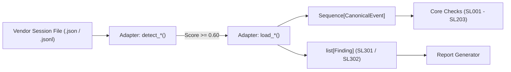

# Adapter Authoring & Conformance Guide

This document is the authoritative specification and implementation guide for contributing format adapters to **SessLint**. It establishes the technical contracts, privacy invariants, synthetic namespacing rules, and verification requirements for transforming vendor-specific session streams into normalized, audit-ready canonical sessions.

---

## 1. Architectural Role of Adapters

In SessLint's architecture, an **Adapter** is a pure, side-effect-free translation layer. Its sole responsibility is parsing external agent session artifacts (e.g. Claude Code JSONL, OpenAI Agents SDK JSON, or custom orchestrator traces) into a normalized sequence of [`CanonicalEvent`](file:///d:/FOR_WORK/WORK_PROJECT/sesslint/src/sesslint/canonical.py) objects.



### Core Invariants

1. **Zero External Dependencies**: Adapters must execute exclusively using the Python 3.11+ standard library (`json`, `re`, `pathlib`, `hashlib`).
2. **Zero In-Place Mutation (Immutability)**: Adapters are read-only. Reading a session must never modify the file on disk or touch access times.
3. **Zero Dynamic Evaluation**: No use of `eval()`, `pickle`, `ctypes`, or dynamic code execution.
4. **Zero Content Leaks in Diagnostics**: Discriminator failures and version errors must never leak user prompt content or session data into finding evidence.
5. **Deterministic Event Generation**: Calling the adapter twice on identical source bytes must produce bit-for-bit identical event IDs, content hashes, and finding fingerprints.

---

## 2. Adapter Interface Contract

Every adapter lives in `src/sesslint/adapters/<adapter_name>.py` and must export the following standard interface.

### A. Detection Function: `detect_<adapter>`

```python
def detect_<adapter>(first_bytes: bytes, filename: str) -> float:
    """Evaluate format confidence score for a candidate session artifact.

    Args:
        first_bytes: The initial byte prefix of the file (up to SNIFF_BYTES = 4096).
        filename: Base filename of the target artifact.

    Returns:
        Confidence float score strictly bounded to [0.0, 1.0].
    """
```

- **Threshold Rules**:
  - A matching session must score $\ge \text{CONFIDENCE\_MIN}$ (`0.60`).
  - Competing adapters must score lower by at least $\text{MARGIN\_MIN}$ (`0.15`) to achieve a `clear-winner` verdict in `detect_format`.
- **Heuristics**:
  - Prefer inspecting structural signatures in `first_bytes` (e.g. characteristic JSON keys, schema declarations, or JSONL record tags).
  - Use filename extensions only as weak tie-breakers; never rely on file extension alone.

### B. Ingestion Loader Function: `load_<adapter>`

```python
def load_<adapter>(
    path: Path | str,
    *,
    limits: ReaderLimits | None = None,
) -> tuple[Sequence[CanonicalEvent], list[Finding]]:
    """Parse session artifact into canonical events and adapter-level findings.

    Args:
        path: Path to session file.
        limits: Hostile-input reader limits (defaults to ReaderLimits()).

    Returns:
        Tuple of (events, findings). Findings contain format-level issues
        such as SL301 (unsupported version) or SL302 (unknown discriminator).
    """
```

- **Limits Enforcement**:
  - Wrap stream iteration with [`ReaderLimits`](file:///d:/FOR_WORK/WORK_PROJECT/sesslint/src/sesslint/io.py) to prevent line-length or record-count resource exhaustion.
- **Fail-Closed on Unknown Version (`SL301`)**:
  - Define an immutable version allowlist:
    ```python
    SUPPORTED_<ADAPTER>_VERSIONS: Final[frozenset[str]] = frozenset({"1.0", "1.1"})
    ```
  - When encountering an unlisted version, append an `SL301` error finding with structured evidence:
    ```python
    findings.append(
        make_finding(
            code=SL301,
            severity=Severity.ERROR,
            repairability=Repairability.MANUAL,
            message_template="Unsupported format version: {version_raw}",
            source=SourceRef(path=str(path), line=line_num),
            evidence={
                "version_raw": raw_version,
                "supported_set": sorted(SUPPORTED_<ADAPTER>_VERSIONS),
            },
        )
    )
    ```

### C. Unknown Discriminators & Safe Bounding (`SL302`)

When an unknown record type or turn kind is encountered:
1. Do not crash or discard the record silently.
2. Filter the discriminator through [`safe_discriminator`](file:///d:/FOR_WORK/WORK_PROJECT/sesslint/src/sesslint/adapters/detect.py) before embedding in evidence:
   - Allowlisted safe alphanumeric identifiers ($\le 32$ chars, matching `^[a-zA-Z0-9_.-]+$`) are echoed verbatim.
   - Overlong or hostile strings containing punctuation, control characters, or secrets are bounded to `<type:len=N>` with `type_truncated=True`.

### D. Synthetic ID Namespacing (DEV-007)

If external session records do not provide persistent, globally-unique IDs:
1. **Reserved Namespace**: Synthetic IDs must strictly follow the prefix:
   ```text
   sesslint:synthetic:<adapter_id>:<seq>:<hash8>
   ```
2. **Helper API**:
   Use [`synthetic_event_id`](file:///d:/FOR_WORK/WORK_PROJECT/sesslint/src/sesslint/adapters/synthetic.py):
   ```python
   from sesslint.adapters.synthetic import synthetic_event_id

   event_id = synthetic_event_id(
       adapter="<adapter_id>",
       seq=record_index,
       source_hint=str(path),
       payload_len=len(raw_record_bytes),
   )
   ```
3. **Collision Guard**:
   Maintain a [`SyntheticIdCollisionGuard`](file:///d:/FOR_WORK/WORK_PROJECT/sesslint/src/sesslint/adapters/synthetic.py) instance during ingest to prevent duplicate IDs or collisions with native IDs.
4. **Never Leak Legacy Prefixes**:
   Do **not** use prefixes like `rec_` or `evt_` for synthetic IDs. Native IDs must set `original_id=event_id`, while synthetic IDs must set `original_id=None`.

### E. Run-State & Checkpoint Projections (DEV-011)

When importing orchestrator checkpoints, execution states, or runtime memory:
- **Redact Raw Values**: Never embed raw prompts, environment variables, or tool outputs into checkpoint finding evidence.
- **Structural Projections**: Transform runtime states into key name lists, value shapes, and lengths:
  ```json
  {
    "state_shape": {
      "variables": ["user_intent", "step_count"],
      "types": {"user_intent": "str:len=42", "step_count": "int"}
    }
  }
  ```

---

## 2. Fixture Authoring & Provenance Recipe

Every adapter must be accompanied by comprehensive test fixtures under `fixtures/<adapter>/` and `fixtures/conformance/<adapter>/`.

### Directory Layout

```text
fixtures/
├── <adapter>/
│   ├── PROVENANCE.json
│   ├── basic.jsonl
│   ├── version_unsupported.jsonl
│   └── ...
└── conformance/
    └── <adapter>/
        ├── PROVENANCE.json
        ├── healthy.<ext>
        ├── version_unsupported.<ext>
        ├── parallel_tool.<ext>
        ├── synthetic_ids.<ext>
        ├── discriminator_safe.<ext>
        └── discriminator_hostile.<ext>
```

### Mandatory `PROVENANCE.json`

Every directory containing fixtures must have a `PROVENANCE.json` defining license and origin:

```json
{
  "fixtures": {
    "healthy.jsonl": {
      "origin": "synthetic",
      "license": "Apache-2.0",
      "sanitized": true,
      "contains_pii": false,
      "description": "Minimal healthy session conforming to format specification."
    }
  }
}
```

### Privacy & Sanitization Hygiene

- **Zero Real Transcripts**: Real session logs from production environments or private LLM conversations are strictly prohibited.
- **Canary Tokens in Secret Tests**: For privacy regression tests, use designated dummy tokens matching known secret prefixes (`sk-ant-api03-...`, `sk-live-...`, `AKIA...`) with synthetic payloads only.

---

## 3. Running the Conformance Suite

SessLint provides a unified, data-driven cross-adapter conformance test suite in [`tests/conformance/test_adapter_suite.py`](file:///d:/FOR_WORK/WORK_PROJECT/sesslint/tests/conformance/test_adapter_suite.py).

To execute the suite locally:

```bash
# 1. Run the unified cross-adapter suite
uv run pytest tests/conformance/test_adapter_suite.py -v

# 2. Run all conformance matrix gates
uv run pytest tests/conformance/ -q

# 3. Run adapter-specific unit test suites
uv run pytest tests/adapters/ -q

# 4. Verify privacy invariants and secret shielding
uv run pytest tests/privacy/ -q
```

All tests must pass 100% green before submitting an adapter PR.

---

## 4. Version-Bump Checklist

When an upstream vendor publishes a new schema or format revision (e.g. Claude Code v2.0 or OpenAI Agents SDK v1.5):

- [ ] **1. Create Reproduction Fixtures**:
  - Add an unedited sample of the new format to `fixtures/<adapter>/`.
  - Document origin and license in `fixtures/<adapter>/PROVENANCE.json`.
- [ ] **2. Verify Detection Independence**:
  - Confirm `detect_<adapter>` recognizes the new revision without false-triggering other adapters.
- [ ] **3. Update Version Set**:
  - Add the new version string to `SUPPORTED_<ADAPTER>_VERSIONS` in `src/sesslint/adapters/<adapter>.py`.
- [ ] **4. Update Schema Mapping**:
  - Map any newly introduced turn kinds or message fields to `CanonicalEvent`.
  - Ensure any unknown tags map gracefully to `SL302` with bounded discriminators.
- [ ] **5. Run Conformance Suite**:
  - Run `uv run pytest tests/conformance/test_adapter_suite.py -v`.
- [ ] **6. Update Documentation**:
  - Update supported version tables in `docs/codes/` and `src/sesslint/cli.py` (`formats` command).

---

## 5. Adapter Fidelity Backlog

The table below tracks known open questions regarding upstream vendor formats. These items are classified as `SECONDARY_UNVERIFIED` until primary upstream documentation or consented real-world session captures confirm their semantics.

| Format / Adapter | Mechanism / Field | Current Classification | Status | Evidence Needed |
| :--- | :--- | :--- | :--- | :--- |
| `claude-code-jsonl` | `sourceToolAssistantUUID` | `SECONDARY_UNVERIFIED` | Pending Research | Upstream trace proving multi-agent subagent linkage semantics. |
| `claude-code-jsonl` | Record-type vocabulary expansion | `SECONDARY_UNVERIFIED` | Monitored | Verification whether new Claude Code CLI versions introduce types beyond `user`, `assistant`, `tool`. |
| `claude-code-jsonl` | Summary / Compaction records | `SECONDARY_UNVERIFIED` | Monitored | Confirming whether Claude Code emits explicit checkpoint markers or relies on implicit turn drops. |
| `openai-agents` | Compaction items in run items | `SECONDARY_UNVERIFIED` | Monitored | Schema verification for OpenAI Agents SDK memory condensation records. |
| `openai-agents` | Multi-agent handoff delegation | `SECONDARY_UNVERIFIED` | Monitored | Conformance traces for `agent_handoff` items between distinct agent definitions. |

---

*For questions or guidance on contributing adapters, open an issue using the [Adapter Request Template](file:///.github/ISSUE_TEMPLATE/adapter_request.md) or join repository discussions.*
